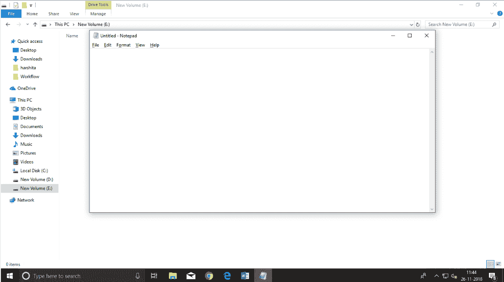
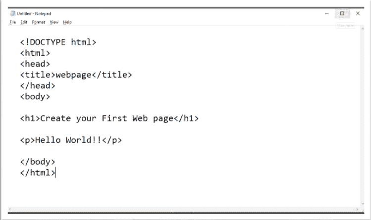
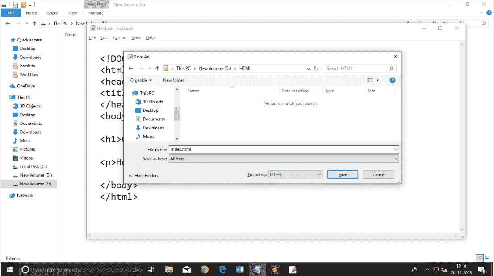
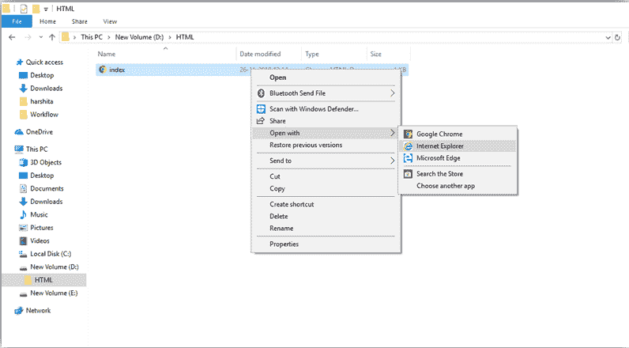
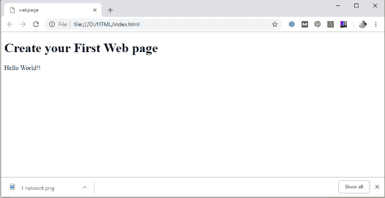
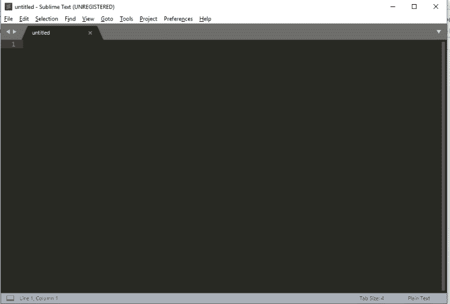
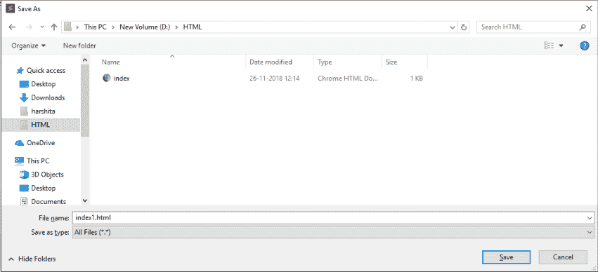
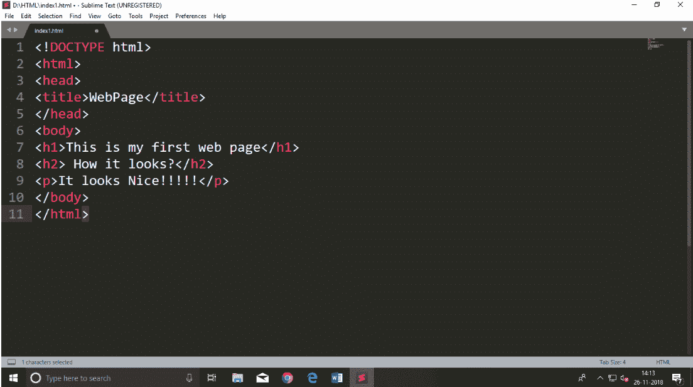
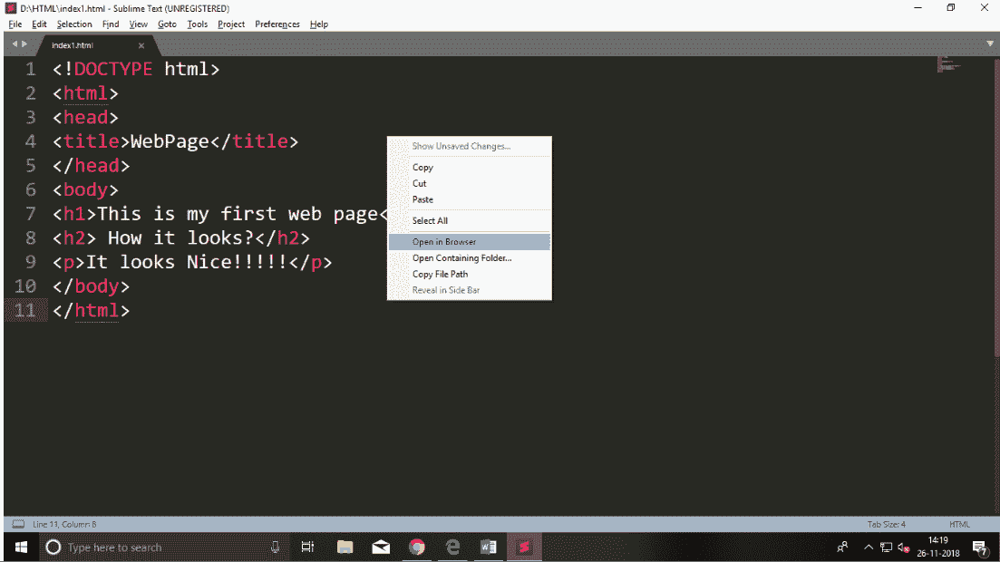
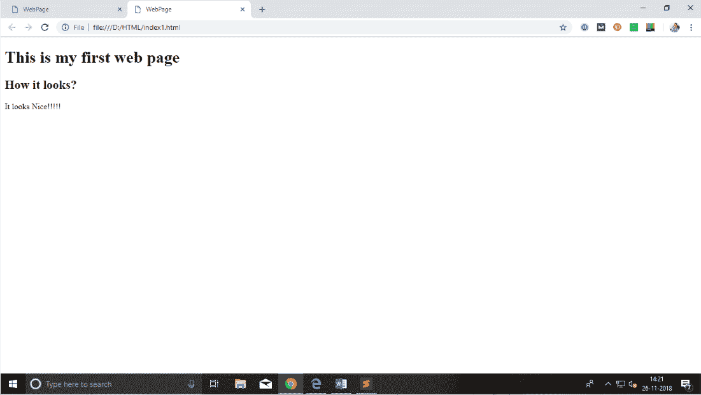

# HTML 文本编辑器

> 原文：<https://www.javatpoint.com/html-text-editors>

*   一个 HTML 文件是一个文本文件，所以为了创建一个 HTML 文件，我们可以使用任何文本编辑器。
*   文本编辑器是允许在书面文本中进行编辑的程序，因此要创建网页，我们需要在一些文本编辑器中编写代码。
*   有各种类型的文本编辑器可以直接下载，但是对于初学者来说，最好的文本编辑器是记事本(窗口)或文本编辑(苹果)。
*   学完基础之后，可以轻松使用其他专业的文本编辑器，分别是，**记事本++，崇高文本，Vim 等**。
*   在我们的教程中，我们将使用记事本和崇高的文本编辑器。以下是用记事本创建第一个网页和升华文本的一些简单方法。

## A.带记事本的 HTML 代码。(推荐初学者使用)

记事本是一个简单的文本编辑器，适合初学者学习 HTML。它在所有版本的 Windows 中都可用，您可以从那里轻松访问它。

**第一步:打开记事本(窗口)**

**第二步:用 HTML 写代码**

**第三步:用保存 HTML 文件。htm 或。html 扩展。**

**第四步:在网页浏览器中打开 HTML 页面。**

要运行 HTML 页面，您需要打开保存文件的文件位置，然后双击文件或单击打开选项

* * *

## B.带有高级文本编辑器的 HTML 代码。(学习完 HTML 基础知识后推荐)

当你将学习 HTML 的基础知识时，那么你可以使用一些专业的文本编辑器，这将帮助你编写一个高效快速的代码。所以要使用崇高文本编辑器，首先需要从网上下载安装。你可以很容易地从这个[https://www.sublimetext.com/download](https://www.sublimetext.com/download)链接下载它，并可以安装在你的电脑上。崇高文本编辑器安装完成后，您可以按照简单的步骤使用它:

**第一步:打开崇高文本编辑器(Windows 8):**

要打开威震文本编辑器，请转到**开始屏幕⤏类型威震 Text⤏打开**它。要打开新页面，请按**CTRL+n**

**第二步:在编写任何代码之前保存页面。**

要以高级文本保存页面，请按 Ctrl+S 或转到文件选项⤏保存，要保存文件，请使用扩展名。我们建议首先保存文件，然后编写代码，因为保存页面后，崇高的文本编辑器会给你编写代码的建议。

**第三步:在崇高文本编辑器**中编写代码

**第四步:在浏览器中打开 HTML 页面**

要在网络浏览器中执行或打开此页面，只需在高级文本页面上用鼠标右键单击，然后单击**在浏览器中打开**。

#### 注意:你可以在任何浏览器中执行 HTML 文件，但是有些标签是某些网页浏览器不支持的。