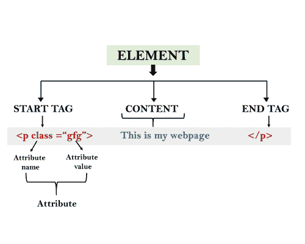

# HTML 的构造块

> 原文：<https://www.javatpoint.com/html-building-blocks>

一个超文本标记语言文档由以下基本构件组成:

*   **标签:**一个 HTML 标签包围着内容，并对其应用含义。写在<和>括号之间。
*   **属性:**HTML 中的一个属性提供了关于元素的额外信息，它被应用在开始标签中。一个 HTML 属性包含两个字段:名称&值。

## 句法

```

<tag name  attribute_name= " attr_value"> content </ tag name> 

```

*   **元素:**HTML 元素是 HTML 文件的一个独立组件。在一个 HTML 文件中，所有写在标签中的东西都被称为 HTML 元素。



## 示例:

```

<!DOCTYPE html>
<html>
  <head>
	<title>The basic building blocks of HTML</title>
 </head>
  <body>
       <h2>The building blocks</h2>
       <p>This is a paragraph tag</p>
       <p style="color: red">The style is attribute of paragraph tag</p>
       <span>The element contains tag, attribute and content</span>
  </body>
</html>	

```

[Test it Now](https://www.javatpoint.com/oprweb/test.jsp?filename=htmlBuildingblocks)

**输出:**

<title>The basic building blocks of HTML</title>

## 积木

这是一个段落标记

样式是段落标记的属性

The element contains tag, attribute and content