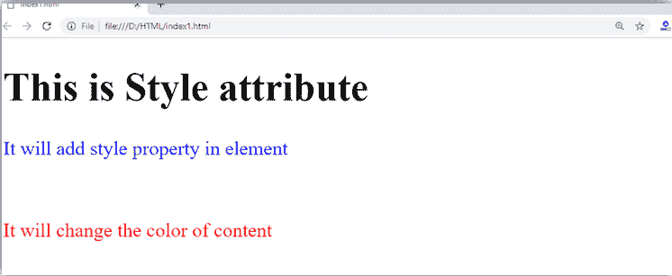
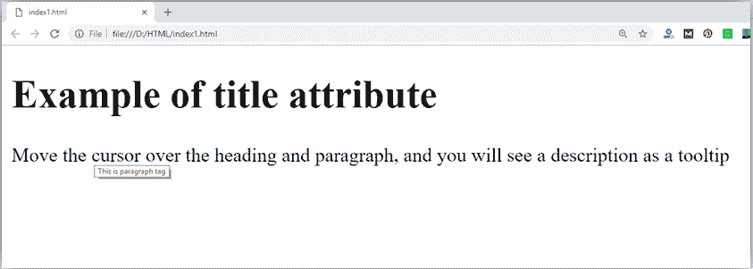
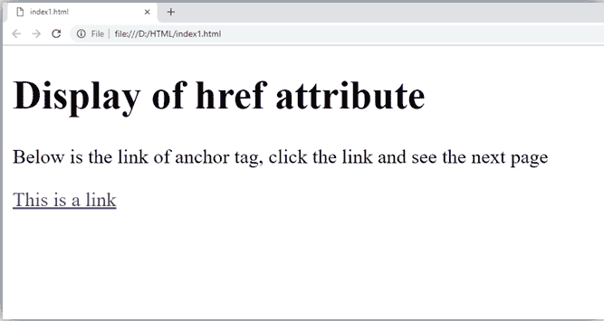

# HTML 属性

> 原文:[https://www.javatpoint.com/html-attributes](https://www.javatpoint.com/html-attributes)

*   HTML 属性是提供元素附加信息的特殊词，或者属性是 HTML 元素的修饰语。
*   每个元素或标签都可以有定义该元素行为的属性。
*   属性应该始终与开始标记一起应用。
*   属性应始终应用其名称和值对。
*   属性名称和值区分大小写，W3C 建议只使用小写形式。
*   您可以在一个 HTML 元素中添加多个属性，但需要在两个属性之间留出空间。

* * *

## 句法

```

<element attribute_name="value">content</element>

```

* * *

## 例子

```

 <!DOCTYPE html>
<html>
<head>
</head>
<body>
    <h1> This is Style attribute</h1>
   <p style="height: 50px; color: blue">It will add style property in element</p>
    <p style="color: red">It will change the color of content</p>
</body>
</html>

```

[Test it Now](https://www.javatpoint.com/oprweb/test.jsp?filename=htmlattributes)

**输出:**



**以上示例说明:**

```

<p style="height: 50px; color: blue">It will add style property in element</p>

```

[Test it Now](https://www.javatpoint.com/oprweb/test.jsp?filename=htmlattributes1)

在上面的陈述中，我们使用了段落标签，其中我们应用了样式属性。此属性用于对任何 HTML 元素应用 CSS 属性。它为 50px 的段落元素提供高度，并将其颜色变为蓝色。

```

<p style="color: red">It will change the color of content</p>

```

在上面的语句中，我们再次在段落标记中使用了 style 属性，它将颜色变为红色。

#### 注意:下面给出了一些常用的属性，在 HTML 属性列表中给出了所有属性的完整列表和说明。

* * *

## HTML 中的标题属性

**描述:**标题属性在大部分浏览器中都是作为文本工具提示使用的。当用户将光标移动到链接或任何文本上时，它会显示文本。您可以将其与任何文本或链接一起使用，以显示关于该链接或文本的描述。在我们的例子中，我们使用段落标签和标题标签。

## 例子

**带< h1 >标签:**

```

<h1 title="This is heading tag">Example of title attribute</h1>

```

[Test it Now](https://www.javatpoint.com/oprweb/test.jsp?filename=htmlattributes2)

**带< p >标签:**

```

<p title="This is paragraph tag">Move the cursor over the heading and paragraph, and you will see a description as a tooltip</p>

```

[Test it Now](https://www.javatpoint.com/oprweb/test.jsp?filename=htmlattributes3)

**代码:**

```

<!DOCTYPE html>
<html>
  <head>
 </head>
<body>

  <h1 title="This is heading tag">Example of title attribute</h1>
  <p title="This is paragraph tag">Move the cursor over the heading and paragraph, and you will see a description as a tooltip</p>

</body>
</html>

```

[Test it Now](https://www.javatpoint.com/oprweb/test.jsp?filename=htmlattributes4)

**输出:**



* * *

## HTML 中的 href 属性

**描述:**href 属性是< a >主播标签的主要属性。该属性给出了在该链接中指定的链接地址。**href 属性提供超链接，如果为空，则保持在同一页面**中。

## 例子

**带链接地址:**

```

<a href="https://www.javatpoint.com/html-anchor">This is a link</a>

```

[Test it Now](https://www.javatpoint.com/oprweb/test.jsp?filename=htmlattributes5)

**无链接地址:**

```

<a href="">This is a link</a>

```

[Test it Now](https://www.javatpoint.com/oprweb/test.jsp?filename=htmlattributes6) 

* * *

## src 属性

**src** 属性是 **< img >** 元素的重要必备属性之一。它是需要在浏览器上显示的图像的来源。该属性可以包含同一目录或另一个目录中的图像。图像名称或来源应该正确，否则浏览器将不会显示图像。

## 例子

```


```

[Test it Now](https://www.javatpoint.com/oprweb/test.jsp?filename=htmlattributes8)

#### 注意:上面的例子也有高度和宽度属性，定义了网页上图像的高度和宽度。

**输出:**


* * *

## 引号:单引号还是双引号？

在本章中，您已经看到，我们使用了带双引号的属性，但是有些人可能会在 HTML 中使用单引号。所以使用带有 HTML 属性的单引号，也是允许的。以下两种说法都绝对没问题。

```

<a href="https://www.javatpoint.com">A link to HTML.</a>
<a href='https://www.javatpoint.com'>A link to HTML.</a>

```

[Test it Now](https://www.javatpoint.com/oprweb/test.jsp?filename=htmlattributes10)

在 HTML5 中，您还可以省略属性值周围引号的使用。

```

<a href=https://www.javatpoint.com>A link to HTML.</a>

```

[Test it Now](https://www.javatpoint.com/oprweb/test.jsp?filename=htmlattributes11)