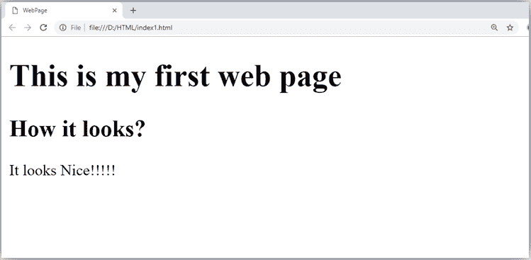
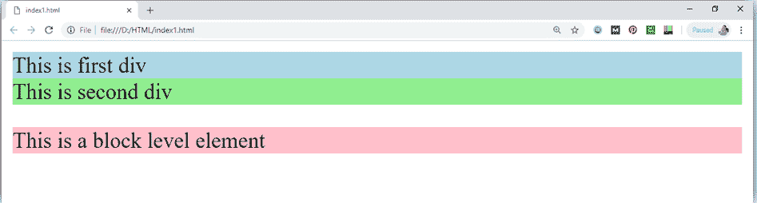
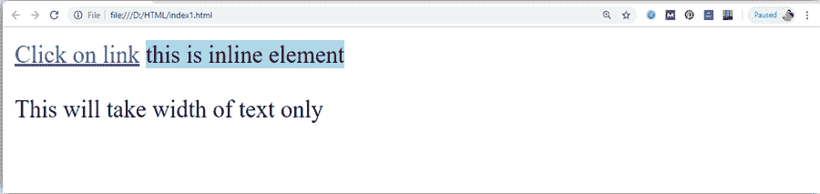

# 超文本标记语言元素

> 原文:[https://www.javatpoint.com/html-elements](https://www.javatpoint.com/html-elements)

一个 HTML 文件是由元素组成的。这些元素负责创建网页并定义网页中的内容。HTML 中的一个元素通常由开始标签<tag name="">、结束标签</tag>和插入其中的内容组成。**从技术上讲，元素是开始标记、属性、结束标记以及它们之间内容的集合**。

#### 注意:有些元素没有结束标记和内容，这些元素被称为空元素或自封闭元素或空元素。

例如:

```

 <p> Hello world!!! </p> 

```

## 例子

```

<!DOCTYPE html>
<html>
<head>
    <title>WebPage</title>
</head>
<body>
   <h1>This is my first web page</h1>
    <h2> How it looks?</h2>
     <p>It looks Nice!!!!!</p>
</body>
</html>

```

[Test it Now](https://www.javatpoint.com/oprweb/test.jsp?filename=htmlelements) 

*   所有写在主体元素之间的内容在网页上都是可见的。

**Void 元素:**HTML 中的所有元素都不要求有开始标签和结束标签，有些元素没有内容和结束标签这样的元素被称为 Void 元素或空元素。**这些元素也被称为不成对标签**。

**部分 Void 元素为< br >(代表断线)< hr >(代表水平线)等。**

**嵌套 HTML 元素:** HTML 可以嵌套，这意味着一个元素可以包含另一个元素。

* * *

## 块级和内嵌的 HTML 元素

出于 HTML 中默认显示和样式的目的，所有元素都分为两类:

*   块级元素
*   内嵌元素

* * *

## 块级元素:

*   这些元素通过将页面划分成连贯的块来构成网页的主要部分。
*   块级元素总是以新行开始，从左到右占据整个网页的宽度。
*   这些元素可以包含块级元素和内联元素。

以下是 HTML 中的块级元素。

<address>、

<article>、

<aside>、

> 、
> 
> <canvas>、
> 
> 、、、
> 
> 、
> 
> <fieldset>、
> 
> <figcaption>、
> 
> <figure>、
> 
> <footer>、
> 
> <form>、
> 
> # -
> 
> ###### 、
> 
> <header>、
> 
> * * *
> 
> 、*   、
>     
>     <main>、
>     
>     <nav>、
>     
>     <noscript>、<ol>、<output>、<p>、</p><pre>、<section>、</section></pre></output></ol></noscript>
>     
>     T26</nav>
>     
>     </main>
>     
>     </header>
> 
> </form>
> 
> </footer>
> 
> </figure>
> 
> </figcaption>
> 
> </fieldset>
> 
> </canvas>

</aside>

</article>

</address>

#### 注意:所有这些元素将在后面的章节中描述。

## 示例:

```

<!DOCTYPE html>
<html>
             <head>
	</head>
<body>
    <div style="background-color: lightblue">This is first div</div>
    <div style="background-color: lightgreen">This is second div</div>
    <p style="background-color: pink">This is a block level element</p>
</body>
</html>

```

[Test it Now](https://www.javatpoint.com/oprweb/test.jsp?filename=htmlelements2)

**输出:**



在上面的例子中，我们使用了

tag, which defines a section in a web page, and takes full width of page.

我们已经使用了样式属性，它用于设置 HTML 内容的样式，背景颜色显示它是一个块级别的元素。

* * *

## 内嵌元素:

*   内联元素是那些区分给定文本部分并为其提供特定功能的元素。
*   这些元素不是以新的线条开始，而是按照要求取宽度。
*   内联元素主要用于其他元素。

## 示例:

```

<!DOCTYPE html>
<html>
    <head>
	</head>
<body>
    <a href="https://www.javatpoint.com/html-tutorial">Click on link</a>
    <span style="background-color: lightblue">this is inline element</span>
    <p>This will take width of text only</p>
 </body>
</html> 

```

[Test it Now](https://www.javatpoint.com/oprweb/test.jsp?filename=htmlelements3)

**输出:**



以下是 HTML 中使用的一些主要元素的列表:

| 开始标记 | 内容 | 结束标记 | 描述 |
| 

# ......

 | 这些是超文本标记语言的标题 | ？？.. | 这些元素用于提供页面的标题。 |
|  | 这是段落 |  | 此元素用于以段落形式显示内容。 |
|  | 这是分区 |  | 此元素用于在网页中提供一个部分。 |
| 
 |  |  | 该元素用于提供换行符。(空元素) |
| 

* * *

 |  |  | 该元素用于提供水平线。(空元素) |