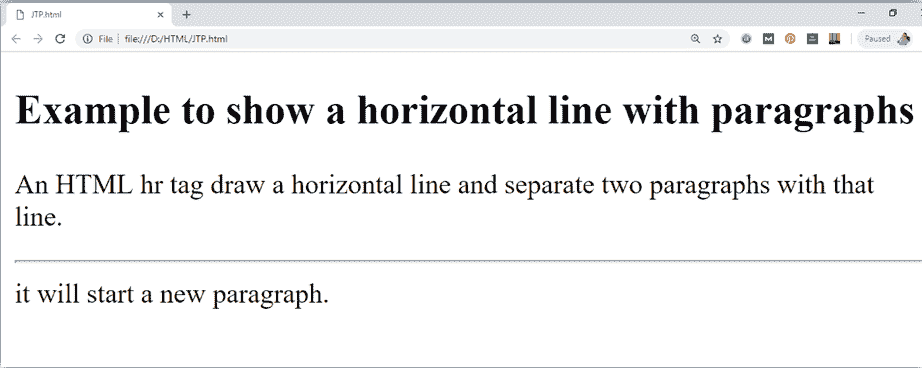

# HTML 段落

> 原文：<https://www.javatpoint.com/html-paragraph>

HTML 段落或 HTML p 标记用于定义网页中的段落。让我们举一个简单的例子来看看它是如何工作的。值得注意的一点是，浏览器本身会在段落前后添加一个空行。一个 HTML

标签指示新段落的开始。

#### 注意:如果我们在一个 HTML 文件中使用各种

标签，那么浏览器会自动在两段之间添加一个空行。

请看这个例子:

```
这是第一段。
这是第二段。
这是第三段。

```

[Test it Now](https://www.javatpoint.com/oprweb/test.jsp?filename=htmlparagraph1)

输出:

这是第一段。

这是第二段。

这是第三段。

* * *

## HTML 段落内的空间

如果在 HTML p 标签中放入大量空格，浏览器会在显示页面时删除多余的空格和多余的行。浏览器将空格和线条的数量计算为一个。

```
我打算给你提供一个关于 HTML 的教程，希望对你非常有益。
看，我在这里放了很多空格，但我知道，浏览器会忽略它。
您无法决定 HTML 的显示
因为调整窗口大小可能会产生不同的结果。

```

[Test it Now](https://www.javatpoint.com/oprweb/test.jsp?filename=htmlparagraph2)

输出:

我打算给你提供一个关于 HTML 的教程，希望对你非常有益。

看，我在这里放了很多空格，但我知道，浏览器会忽略它。

您无法决定 HTML 的显示

因为调整窗口大小可能会产生不同的结果。

如您所见，浏览器删除了所有多余的行和不必要的空格。

* * *

## 如何用
和

* * *

标记段落？

一个 HTML
标签用于换行符，可以和段落元素一起使用。下面是展示如何使用

元素的例子。

**示例:**

```

      使用带段落标记的换行符
          爸爸和妈妈，宝宝和小点，威利和我？圣诞节那天，我们所有人都乘着宾伯利的雪橇去了祖母家。

```

[Test it Now](https://www.javatpoint.com/oprweb/test.jsp?filename=htmlparagraph3)

**输出:**


HTML

* * *

标签用于在两个语句或两段之间应用水平线。以下示例显示了带段落的

* * *

标签的使用。

**示例:**

```

   用段落显示水平线的示例
     一个 HTML hr 标记画一条水平线，并用这条线分隔两段。 it will start a new paragraph.

```

[Test it Now](https://www.javatpoint.com/oprweb/test.jsp?filename=htmlparagraph4)

**输出:**



* * *

## 支持浏览器

| 元素 | 铬 |  IE |  Firefox | 歌剧 |  Safari |
|  | 是 | 是 | 是 | 是 | 是 |