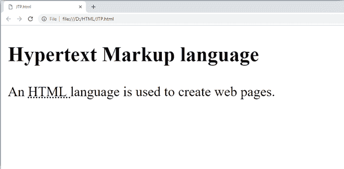
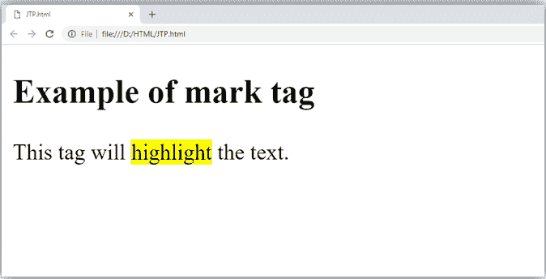
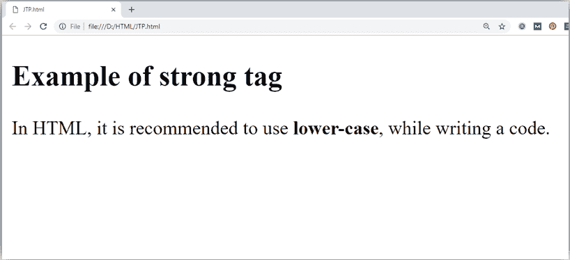
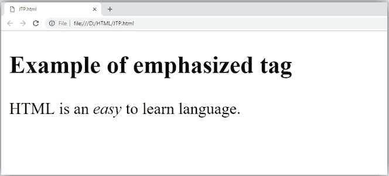
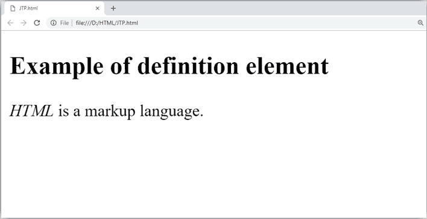
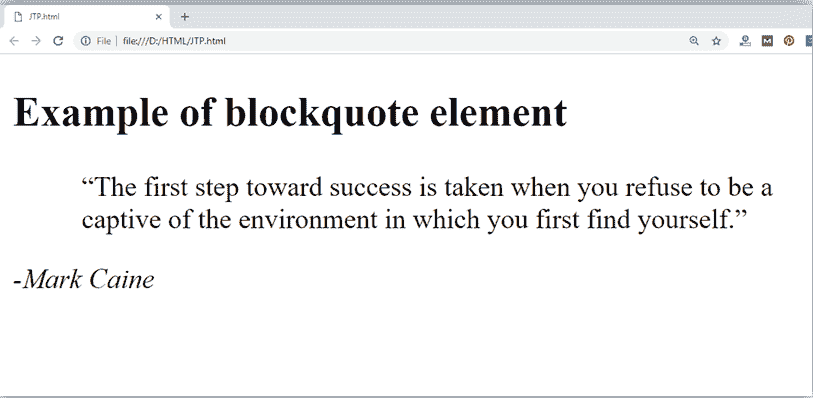
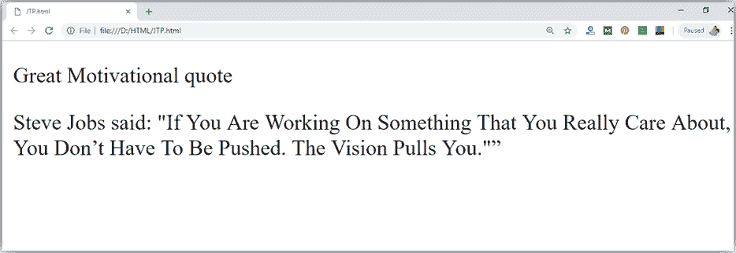
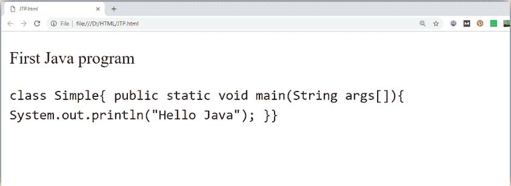
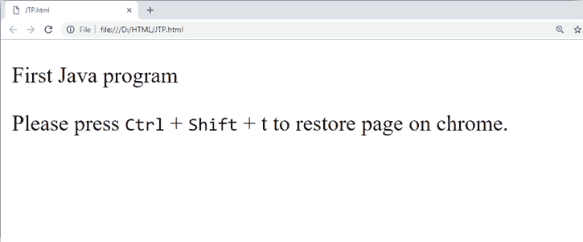
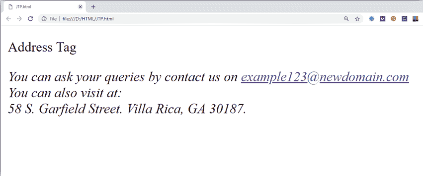

# HTML短语标签

> 原文：<https://www.javatpoint.com/html-phrase-tags>

HTML 短语标签是特殊用途的标签，它定义了文本块的结构意义或文本的语义。下面是短语标签的列表，其中一些我们已经在 HTML 格式中讨论过了。

*   缩写标签:
*   首字母缩略词标签:<acronym>(html 5 不支持)</acronym>
*   标记标签:<mark></mark>
*   强标签:
***   强调标签:**   定义标签:*   报价标签:*   简短引用标签:*   代码标签:`*   键盘标签:*   地址标签:`***

 ***`* * *

## 1.文本缩写标签

该标签用于缩写文本。要缩写文本，请在<abbr>和</abbr>标签之间书写文本。

## 例子

```

<p>An <abbr title = "Hypertext Markup language">HTML </abbr>language is used to create web pages. </p>

```

[Test it Now](https://www.javatpoint.com/oprweb/test.jsp?filename=htmlphrasetag1)

**输出:**



* * *

## 2.标记标签:

在<mark>和</mark>标签之间写入的内容将在浏览器上显示为黄色标记。此标签用于突出显示特定文本。

## 例子

```

<p>This tag will <mark>highlight</mark> the text.</p>

```

[Test it Now](https://www.javatpoint.com/oprweb/test.jsp?filename=htmlphrasetag2)

**输出:**



* * *

## 3.强文本:

该标签用于显示内容的重要文本。在**和**之间写入的文本将显示为重要文本。

## 例子

```

<p>In HTML it is recommended to use <strong>lower-case</strong>, while writing a code. </p>

```

[Test it Now](https://www.javatpoint.com/oprweb/test.jsp?filename=htmlphrasetag3)

**输出:**



* * *

## 4.强调文本

该标签用于强调文本，并以斜体形式显示文本。在*和*标签之间书写的文本将成为斜体文本。

## 例子

```

 <p>HTML is an <em>easy </em>to learn language.</p>

```

[Test it Now](https://www.javatpoint.com/oprweb/test.jsp?filename=htmlphrasetag4)

**输出:**



* * *

## 5.定义标签:

当您使用<dfn>和</dfn>标签时，它允许指定内容的关键字。下面是演示如何定义元素的示例。

## 例子

```

<p><dfn>HTML </dfn> is a markup language. </p>

```

[Test it Now](https://www.javatpoint.com/oprweb/test.jsp?filename=htmlphrasetag5)

**输出:**



* * *

## 6.引用文本:

HTML

> The element shows that the contained content is referenced from another source. Use the reference attribute to give the source web address, and use **< > to display the text representation of the source ... </reference > element** .

## 例子

```

<blockquote cite="https://www.keepinspiring.me/famous-quotes/"><p>?The first step toward success is taken when you refuse to be a captive of the environment in which you first find yourself.?</p></blockquote> 
 <cite>-Mark Caine</cite>

```

[Test it Now](https://www.javatpoint.com/oprweb/test.jsp?filename=htmlphrasetag6)

**输出:**



* * *

## 7.简短报价:

一个 HTML <q>.......</q>元素定义了一个短引号。如果你将任何内容放在<q>之间.......</q>，则用双引号将文本括起来。

## 示例:

```

<p>Steve Jobs said: <q>If You Are Working On Something That You Really Care About, You Don?t Have To Be Pushed. The Vision Pulls You.</q>?</p>

```

[Test it Now](https://www.javatpoint.com/oprweb/test.jsp?filename=htmlphrasetag7)

**输出:**



* * *

## 8.代码标签

HTML 元素用于显示计算机代码的部分。它将以等宽字体显示内容。

```

<p>First Java program</p>
      <p><code>class Simple{ public static void main(String args[]){ 
       System.out.println("Hello Java"); }} </code>
     </p>

```

[Test it Now](https://www.javatpoint.com/oprweb/test.jsp?filename=htmlphrasetag8)

**输出:**



* * *

## 9.键盘标签

在 HTML 中，键盘标签`表示一段内容是用户从键盘输入的。`

```

<p>Please press <kbd>Ctrl</kbd> + <kbd>Shift</kbd> + t<kbd></kbd> to restore page on chrome.</p>

```

[Test it Now](https://www.javatpoint.com/oprweb/test.jsp?filename=htmlphrasetag9)

**输出:**



* * *

## 10.地址标签

一个 HTML

<address>标签定义了关于内容作者的联系信息。写在

<address>和</address>

标签之间的内容，则以斜体显示。</address>

```

 <address> You can ask your queries by contact us on <a href="">example123@newdomain.com</a>
    <br> You can also visit at: <br>58 S. Garfield Street. Villa Rica, GA 30187.
   </address>

```

[Test it Now](https://www.javatpoint.com/oprweb/test.jsp?filename=htmlphrasetag10)

**输出:**

`***