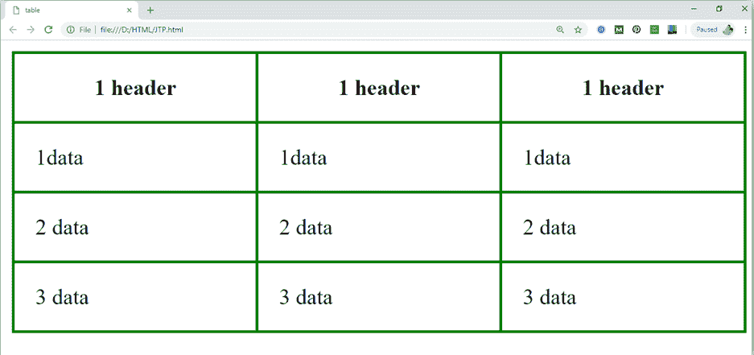
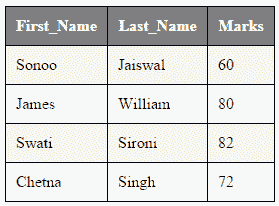

# HTML 表格

> 原文:[https://www.javatpoint.com/html-table](https://www.javatpoint.com/html-table)

**HTML 表格标签**用于以表格形式(行*列)显示数据。一行可以有许多列。

借助、andElement, we can use element to create a table to display data in tabular form.

每个表中，表行由标签定义，表头由Definition, table data is defined byLabel definition.

HTML 表格用于管理页面的布局，例如页眉部分、导航栏、正文内容、页脚部分等。但是建议在表格上使用 div 标签来管理页面的布局。

* * *

## 表格标签

| 标签 | 描述 |
| 元素一起用于指定每列的列属性。

&#124; 它定义了一个表。 &#124;
&#124;  &#124;
&#124; 它定义了表中的一行。 &#124;
&#124;  &#124;  &#124; 它定义了表格中的标题单元格。 &#124;
&#124;  &#124;  &#124; 它定义了表格中的一个单元格。 &#124;
&#124;  &#124;<caption></caption>
&#124; 它定义了表格标题。 &#124;
&#124;  &#124;
&#124; 它指定表格中的一组一列或多列进行格式化。 &#124;
&#124;  &#124;<colgroup><col></colgroup>
&#124; 它与 &#124;
&#124;  &#124;
&#124; 它用于将表格中的正文内容分组。 &#124;
&#124;  &#124;
&#124; 它用于对表格中的标题内容进行分组。 &#124;
&#124; --- &#124;
&#124;  &#124; 它用于对表格中的页脚内容进行分组。 &#124;
&#124; --- &#124; --- &#124;

* * *

## 超文本标记语言表格示例

让我们看看 HTML 表格标签的例子。它的输出如上所示。

```
<table>
<tr><th>First_Name</th><th>Last_Name</th><th>Marks</th></tr>
<tr><td>Sonoo</td><td>Jaiswal</td><td>60</td></tr>
<tr><td>James</td><td>William</td><td>80</td></tr>
<tr><td>Swati</td><td>Sironi</td><td>82</td></tr>
<tr><td>Chetna</td><td>Singh</td><td>72</td></tr>
</table>

```

[Test it Now](https://www.javatpoint.com/oprweb/test.jsp?filename=htmltable1)**输出:**

&#124; 名字 &#124; 姓氏 &#124; 马克斯 &#124;
&#124; 我是子 &#124; 杰史瓦 &#124; Sixty &#124;
&#124; 詹姆斯 &#124; 威廉 &#124; Eighty &#124;
&#124; 斯瓦蒂语 &#124; Sironi 的 &#124; Eighty-two &#124;
&#124; 切特那 &#124; 辛格 &#124; seventy-two &#124;

在上面的 html 表中，有 5 行 3 列= 5 * 3 = 15 个值。

* * *

## 带边框的 HTML 表格

有两种方法可以为 HTML 表格指定边框。

1.  按表格的边框属性
2.  按 CSS 中的边框属性

* * *

## 1) HTML 边框属性

可以在 HTML 中使用表格标签的边框属性来指定边框。但是现在不推荐。

```
<table border="1">
<tr><th>First_Name</th><th>Last_Name</th><th>Marks</th></tr>
<tr><td>Sonoo</td><td>Jaiswal</td><td>60</td></tr>
<tr><td>James</td><td>William</td><td>80</td></tr>
<tr><td>Swati</td><td>Sironi</td><td>82</td></tr>
<tr><td>Chetna</td><td>Singh</td><td>72</td></tr>
</table>

```

[Test it Now](https://www.javatpoint.com/oprweb/test.jsp?filename=htmltable3)**输出:**

&#124; 名字 &#124; 姓氏 &#124; 马克斯 &#124;
&#124; 我是子 &#124; 杰史瓦 &#124; Sixty &#124;
&#124; 詹姆斯 &#124; 威廉 &#124; Eighty &#124;
&#124; 斯瓦蒂语 &#124; Sironi 的 &#124; Eighty-two &#124;
&#124; 切特那 &#124; 辛格 &#124; seventy-two &#124;

* * *

## 2) CSS 边框属性

现在建议使用 CSS 的边框属性来指定表格中的边框。

```
<style>
table, th, td {
  border: 1px solid black;
}
</style>

```

[Test it Now](https://www.javatpoint.com/oprweb/test.jsp?filename=htmltable4)您可以通过边框折叠属性折叠一个边框中的所有边框。它会把边界折叠成一条线。

```
<style>
table, th, td {
  border: 2px solid black;
  border-collapse: collapse;
}
</style>

```

[Test it Now](https://www.javatpoint.com/oprweb/test.jsp?filename=htmltable5)**输出:**

&#124; 名字 &#124; 姓 &#124; 马克斯 &#124;
&#124; 我是子 &#124; 杰史瓦 &#124; Sixty &#124;
&#124; 詹姆斯 &#124; 威廉 &#124; Eighty &#124;
&#124; 斯瓦蒂语 &#124; Sironi 的 &#124; Eighty-two &#124;
&#124; 切特那 &#124; 辛格 &#124; seventy-two &#124;

* * *

## 带有单元格填充的 HTML 表格

您可以通过两种方式指定表格标题和表格数据的填充:

1.  通过表格的单元格填充属性
2.  通过 CSS 中的填充属性

HTML 表格标签的 cellpadding 属性现在被观察到了。建议使用 CSS。那么我们来看看 CSS 的代码。

```
<style>
table, th, td {
  border: 1px solid pink;
  border-collapse: collapse;
}
th, td {
  padding: 10px;
}
</style>

```

[Test it Now](https://www.javatpoint.com/oprweb/test.jsp?filename=htmltable6)**输出:**

&#124; 名字 &#124; 姓 &#124; 马克斯 &#124;
&#124; 我是子 &#124; 杰史瓦 &#124; Sixty &#124;
&#124; 詹姆斯 &#124; 威廉 &#124; Eighty &#124;
&#124; 斯瓦蒂语 &#124; Sironi 的 &#124; Eighty-two &#124;
&#124; 切特那 &#124; 辛格 &#124; seventy-two &#124;

* * *

## 表格宽度:

我们可以使用 **CSS 宽度**属性指定 HTML 表格宽度。它可以用像素或百分比来指定。我们可以根据自己的要求调整桌子的宽度。下面是用宽度显示表格的示例。

```
table{
     width: 100%; 
    }

```

## 示例:

```
<!DOCTYPE html>
<html>
<head>
	<title>table</title>
	<style>
		table{
			border-collapse: collapse;
			width: 100%; 
		}
	th,td{
		border: 2px solid green; 
		padding: 15px;
	}

	</style>
  </head>
<body>
  <table>
	<tr>
		<th>1 header</th>
		<th>1 header</th>
		<th>1 header</th>
	</tr>
	<tr>
		<td>1data</td>
		<td>1data</td>
		<td>1data</td>
	</tr>
	<tr>
		<td>2 data</td>
		<td>2 data</td>
		<td>2 data</td>
	</tr>
	<tr>
		<td>3 data</td>
		<td>3 data</td>
		<td>3 data</td>
	</tr>
</table>
</body>
</html>

```

[Test it Now](https://www.javatpoint.com/oprweb/test.jsp?filename=htmlTable)**输出:**

* * *

## 带列跨度的超文本标记语言表格

如果要使单元格跨越多列，可以使用 colspan 属性。它将一个单元格/行分成多列，列的数量取决于 colspan 属性的值。让我们看看跨越两列的例子。CSS 代码:

```
<style>
table, th, td {
  border: 1px solid black;
  border-collapse: collapse;
}
th, td {
  padding: 5px;
}
</style>

```

HTML 代码:

```
<table style="width:100%">
  <tr>
  <th>Name</th>
  <th colspan="2">Mobile No.</th>
  </tr>
  <tr>
  <td>Ajeet Maurya</td>
  <td>7503520801</td>
  <td>9555879135</td>
  </tr>
</table>

```

[Test it Now](https://www.javatpoint.com/oprweb/test.jsp?filename=htmltable2)**输出:**

&#124; 名字 &#124; 手机号。 &#124;
&#124; ajeet maurya 你好 &#124; Seven billion five hundred and three million five hundred and twenty thousand eight hundred and one &#124; Nine billion five hundred and fifty-five million eight hundred and seventy-nine thousand one hundred and thirty-five &#124;

* * *

## 带行跨度的超文本标记语言表格

如果要使单元格跨越多行，可以使用 rowspan 属性。它会将一个单元格分成多行。划分的行数将取决于 rowspan 值。让我们看看横跨两行的例子。CSS 代码:

```
<style>
table, th, td {
  border: 1px solid black;
  border-collapse: collapse;
}
th, td {
  padding: 10px;
}
</style>

```

HTML 代码:

```
<table>  
<tr><th>Name</th><td>Ajeet Maurya</td></tr>  
<tr><th rowspan="2">Mobile No.</th><td>7503520801</td></tr>  
<tr><td>9555879135</td></tr>  
</table> 

```

[Test it Now](https://www.javatpoint.com/oprweb/test.jsp?filename=htmltable7)**输出:**

&#124; 名字 &#124; ajeet maurya 你好 &#124;
&#124; 手机号。 &#124; Seven billion five hundred and three million five hundred and twenty thousand eight hundred and one &#124;
&#124; Nine billion five hundred and fifty-five million eight hundred and seventy-nine thousand one hundred and thirty-five &#124;

* * *

## 带标题的 HTML 表格

HTML 标题显示在表格上方。它只能在 table tag 之后使用。

```
<table>
<caption>Student Records</caption>
<tr><th>First_Name</th><th>Last_Name</th><th>Marks</th></tr>
<tr><td>Vimal</td><td>Jaiswal</td><td>70</td></tr>
<tr><td>Mike</td><td>Warn</td><td>60</td></tr>
<tr><td>Shane</td><td>Warn</td><td>42</td></tr>
<tr><td>Jai</td><td>Malhotra</td><td>62</td></tr>
</table>

```

[Test it Now](https://www.javatpoint.com/oprweb/test.jsp?filename=htmltable9)

* * *

## HTML 表格奇偶单元格样式

CSS 代码:

```
<style>
table, th, td {
  border: 1px solid black;
  border-collapse: collapse;
}
th, td {
  padding: 10px;
}
table#alter tr:nth-child(even) {
  background-color: #eee;
}
table#alter tr:nth-child(odd) {
  background-color: #fff;
}
table#alter th {
  color: white;
  background-color: gray;
}
</style>

```

[Test it Now](https://www.javatpoint.com/oprweb/test.jsp?filename=htmltable8)**输出:**

#### 注意:您也可以在表格中使用不同的 CSS 属性创建各种类型的表格。

* * *

## 支持浏览器

&#124; 元素 &#124; 铬 &#124;  IE &#124;  Firefox &#124; 歌剧 &#124;  Safari &#124;
&#124; 

&#124; 是 &#124; 是 &#124; 是 &#124; 是 &#124; 是 &#124;

 &#124;

 |