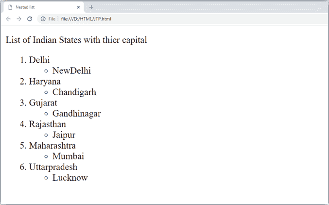

# HTML 列表

> 原文：<https://www.javatpoint.com/html-lists>

HTML 列表用于指定信息列表。所有列表都可能包含一个或多个列表元素。有三种不同类型的 HTML 列表:

1.  有序列表或编号列表(ol)
2.  无序列表或项目符号列表
3.  描述列表或定义列表(dl)

#### 注意:我们可以在另一个列表中创建一个列表，这将被称为嵌套列表。

* * *

## HTML 有序列表或编号列表

在有序的 HTML 列表中，默认情况下，所有列表项都用数字标记。它也被称为编号列表。有序列表以

1.  Mark start.

```html
<ol>
 <li>Aries</li>
 <li>Bingo</li>
 <li>Leo</li>
 <li>Oracle</li>
</ol>

```

[Test it Now](https://www.javatpoint.com/oprweb/test.jsp?filename=htmllists1)

输出:

1.  白羊星座
2.  宾果游戏
3.  狮子星座
4.  神谕

* * *

点击此处查看 HTML 有序列表的全部详细信息。 [HTML 有序列表](html-ordered-list)

* * *

## 无序列表或项目符号列表

在 HTML 无序列表中，所有列表项都用项目符号标记。它也被称为项目符号列表。无序列表以

*   Mark start.

```html
<ul>
 <li>Aries</li>
 <li>Bingo</li>
 <li>Leo</li>
 <li>Oracle</li>
</ul>

```

[Test it Now](https://www.javatpoint.com/oprweb/test.jsp?filename=htmllists2)

输出:

*   白羊星座
*   宾果游戏
*   狮子星座
*   神谕

* * *

点击这里了解 HTML 无序列表的全部细节。 [HTML 无序列表](html-unordered-list)

* * *

## HTML 描述列表或定义列表

HTML 描述列表也是 HTML 和 XHTML 都支持的列表样式。它也被称为定义列表，条目像字典或百科全书一样列出。

当您想要呈现词汇表、术语列表或其他名称-值列表时，定义列表非常合适。

HTML 定义列表包含以下三个标签:

1.  **< dl >标签**定义列表的开始。
2.  **< dt >标签**定义了一个术语。
3.  **< dd >标签**定义了术语定义(描述)。

```html
<dl>
  <dt>Aries</dt>
  <dd>-One of the 12 horoscope sign.</dd>
  <dt>Bingo</dt>
  <dd>-One of my evening snacks</dd>
 <dt>Leo</dt>
 <dd>-It is also an one of the 12 horoscope sign.</dd>
  <dt>Oracle</dt>
  <dd>-It is a multinational technology corporation.</dd> 
</dl>

```

[Test it Now](https://www.javatpoint.com/oprweb/test.jsp?filename=htmllists3)

输出:

Aries

-One of the 12 horoscope sign.

Bingo

-One of my evening snacks

Leo

-It is also an one of the 12 horoscope sign.

Oracle

-It is a multinational technology corporation.

* * *

点击这里查看 HTML 描述列表的全部细节。 [HTML 描述列表](html-description-list)

* * *

## HTML 嵌套列表

另一个列表中的列表称为嵌套列表。如果你想要一个编号列表中的项目符号列表，那么这种类型的列表将被称为嵌套列表。

**代码:**

```html
<!DOCTYPE html>
<html>
<head>
	<title>Nested list</title>
</head>
<body>
	<p>List of Indian States with thier capital</p>
<ol>
	<li>Delhi
		<ul>
			<li>NewDelhi</li>
		</ul>
	</li>
	<li>Haryana
		<ul>
			<li>Chandigarh</li>
		</ul>
	</li>
	<li>Gujarat
		<ul>
			<li>Gandhinagar</li>
		</ul>
	</li>
	<li>Rajasthan 
		<ul>
			<li>Jaipur</li>
		</ul>
	</li>
	<li>Maharashtra
		<ul>
			<li>Mumbai</li>
		</ul>
	</li>
	<li>Uttarpradesh
		<ul>
			<li>Lucknow</li></ul>
	</li>
</ol>
</body>
</html>

```

[Test it Now](https://www.javatpoint.com/oprweb/test.jsp?filename=htmlLists4)

**输出:**



* * *

## 支持浏览器

| 元素 | 铬 |  IE |  Firefox | 歌剧 |  Safari |
|  | 是 | 是 | 是 | 是 | 是 |

* * *