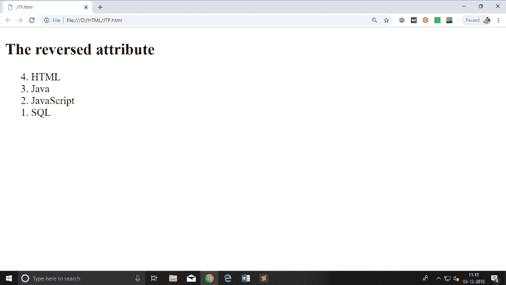

# HTML 有序列表| HTML 编号列表

> 原文：<https://www.javatpoint.com/html-ordered-list>

**HTML 有序列表**或编号列表以编号格式显示元素。HTML ol 标记用于有序列表。我们可以使用有序列表以数字顺序格式或字母顺序格式或任何强调顺序的格式来表示项目。可以有不同类型的编号列表:

*   数字(1，2，3)
*   大写罗马数字(一、二、三)
*   小罗马数字(一、二、三)
*   大写字母
*   小字母表

为了表示不同的有序列表，

| 类型 | 描述 |
| 键入“1” | 这是默认类型。在这种类型中，列表项用数字编号。 |
| 输入“我” | 在这种类型中，列表项用大写罗马数字编号。 |
| 键入“I” | 在这种类型中，列表项用小写罗马数字编号。 |
| 键入“A” | 在这种类型中，列表项用大写字母编号。 |
| 键入“a” | 在这种类型中，列表项用小写字母编号。 |

* * *

## 超文本标记语言有序列表示例

让我们看看 HTML 有序列表的例子，它在编号列表中显示 4 个主题。这里我们没有定义 type="1 "，因为它是默认类型。

```
<ol>
 <li>HTML</li>
 <li>Java</li>
 <li>JavaScript</li>
 <li>SQL</li>
</ol>

```

[Test it Now](https://www.javatpoint.com/oprweb/test.jsp?filename=htmlorderedlist1)

输出:

1.  超文本标记语言
2.  爪哇
3.  Java Script 语言
4.  结构化查询语言

* * *

## ol type="I "

让我们看看用罗马数字大写显示列表的例子。

```
<ol type="I">
 <li>HTML</li>
 <li>Java</li>
 <li>JavaScript</li>
 <li>SQL</li>
</ol>

```

[Test it Now](https://www.javatpoint.com/oprweb/test.jsp?filename=htmlorderedlist2)

输出:

1.  超文本标记语言
2.  爪哇
3.  Java Script 语言
4.  结构化查询语言

* * *

## ol type="i "

让我们看看用小写罗马数字显示列表的例子。

```
<ol type="i">
 <li>HTML</li>
 <li>Java</li>
 <li>JavaScript</li>
 <li>SQL</li>
</ol>

```

[Test it Now](https://www.javatpoint.com/oprweb/test.jsp?filename=htmlorderedlist3)

输出:

1.  超文本标记语言
2.  爪哇
3.  Java Script 语言
4.  结构化查询语言

* * *

## ol type="A "

让我们看看用大写字母显示列表的例子。

```
<ol type="A">
 <li>HTML</li>
 <li>Java</li>
 <li>JavaScript</li>
 <li>SQL</li>
</ol>

```

[Test it Now](https://www.javatpoint.com/oprweb/test.jsp?filename=htmlorderedlist4)

输出:

1.  超文本标记语言
2.  爪哇
3.  Java Script 语言
4.  结构化查询语言

* * *

## ol type="a "

让我们看看用小写字母显示列表的例子。

```
<ol type="a">
 <li>HTML</li>
 <li>Java</li>
 <li>JavaScript</li>
 <li>SQL</li>
</ol>

```

[Test it Now](https://www.javatpoint.com/oprweb/test.jsp?filename=htmlorderedlist5)

输出:

1.  超文本标记语言
2.  爪哇
3.  Java Script 语言
4.  结构化查询语言

* * *

## 开始属性

start 属性与 ol 标记一起使用，以指定从何处开始列表项。

**<ol type = " 1 " start = " 5 ">**:会显示以“5”开头的数值。

**<ol type = " A " start = " 5 ">**:会显示以“E”开头的大写字母。

**<ol type = " a " start = " 5 ">**:会显示以“e”开头的小写字母。

**<ol type = " I " start = " 5 ">**:会显示以“V”开头的罗马大写值。

**<ol type = " I " start = " 5 ">**:会显示以“v”开头的罗马小写值。

```
<ol type="i" start="5">
 <li>HTML</li>
 <li>Java</li>
 <li>JavaScript</li>
 <li>SQL</li>
</ol>

```

[Test it Now](https://www.javatpoint.com/oprweb/test.jsp?filename=htmlorderedlist6)

输出:

5.  超文本标记语言
6.  爪哇
7.  Java Script 语言
8.  结构化查询语言

* * *

## 反向属性:

这是 HTML

## 示例:

```
<ol reversed>
<li>HTML</li>
<li>Java</li>
<li>JavaScript</li>
<li>SQL</li>
 </ol>

```

[Test it Now](https://www.javatpoint.com/oprweb/test.jsp?filename=htmlorderedlist7)

**输出:**



* * *

## 支持浏览器

| 元素 | 铬 |  IE |  Firefox | 歌剧 |  Safari |
|  | 是 | 是 | 是 | 是 | 是 |