# HTML 表单

> 原文：<https://www.javatpoint.com/html-form>

一个 **HTML 表单**是*文档的一部分*，它包含诸如文本字段、密码字段、复选框、单选按钮、提交按钮、菜单等控件。

HTML 表单便于用户输入要发送到服务器进行处理的数据，如姓名、电子邮件地址、密码、电话号码等。。

* * *

## 为什么使用 HTML 表单

如果您想从网站访问者那里收集一些数据，则需要 HTML 表单。

例如:如果用户想在互联网上购买一些物品，他/她必须填写表格，如送货地址和信用卡/借记卡详细信息，以便将物品发送到给定的地址。

* * *

## HTML 表单语法

```
<form action="server url" method="get|post">
  //input controls e.g. textfield, textarea, radiobutton, button
</form>

```

* * *

## HTML 表单标签

让我们看看 HTML 5 表单标签的列表。

| 标签 | 描述 |
|  | 它定义了一个 HTML 表单来输入被使用方的输入。 |
| <input> | 它定义一个输入控件。 |
| <textarea></td><td>它定义了一个多行输入控件。</td></tr> <tr><td><label/></td><td>它为输入元素定义了一个标签。</td></tr> <tr><td><fieldset/></td><td>它将相关元素分组到一个表单中。</td></tr> <tr><td><legend/></td><td>它为<fieldset>元素定义了一个标题。</fieldset></td></tr> <tr><td><select/></td><td>它定义了一个下拉列表。</td></tr> <tr><td><optgroup/></td><td>它在下拉列表中定义了一组相关选项。</td></tr> <tr><td><option/></td><td>它在下拉列表中定义了一个选项。</td></tr> <tr><td><button/></td><td>它定义了一个可点击的按钮。</td></tr> </table> <h2 class="h2">HTML 5 表单标签</h2> <p>让我们看看 HTML 5 表单标签的列表。</p> <table class="alt"> <tr><th>标签</th><th>描述</th></tr> <tr><td><datalist/></td><td>它为输入控制指定了预定义选项的列表。</td></tr> <tr><td><keygen/></td><td>它为表单定义了一个密钥对生成器字段。</td></tr> <tr><td><output/></td><td>它定义了计算的结果。</td></tr> </table> <hr/> <h2 class="h2">HTML <form>元素</form></h2> <p>HTML <form>元素提供了一个文档部分来接受用户的输入。它提供了各种交互控件，用于向 web 服务器提交信息，如文本字段、文本区域、密码字段等。</form></p> <h4 class="n">注意:<form>元素本身并不创建表单，但它是包含所有必需表单元素的容器，如<input/>、<label>等。</label></form></h4> <p><strong>语法:</strong></p> <div class="codeblock"><pre name="code" class="xml"> <form> //Form elements </form> </pre></div> <hr/> <h2 class="h2">HTML <input/>元素</h2> <p>HTML <input/>元素是基本的表单元素。它用于创建表单域，接受用户的输入。我们可以应用不同的输入字段从用户那里收集不同的信息。下面是显示简单文本输入的示例。</p> <h2 class="h2">示例:</h2> <div class="codeblock"><pre name="code" class="xml"> <body> <form> Enter your name <br> <input type="text" name="username"> </form> </body> </pre></div> <p><strong>输出:</strong></p> 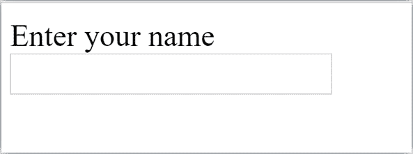 <hr/> <h2 class="h2">HTML 文本字段控件</h2> <p>输入标记的 type="text "属性创建 textfield 控件，也称为单行 textfield 控件。名称属性是可选的，但对于服务器端组件如 JSP、ASP、PHP 等是必需的。</p> <div class="codeblock"><pre name="code" class="xml"> <form> First Name: <input type="text" name="firstname"/> <br/> Last Name: <input type="text" name="lastname"/> <br/> </form> </pre></div> <p><strong>输出:</strong></p> 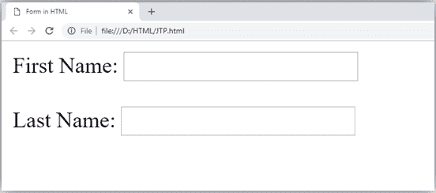 <h4 class="n">注意:如果省略“名称”属性，则文本字段输入将不会提交给服务器。</h4> <hr/> <h2 class="h2">表单中的 HTML <textarea>标签</textarea>HTML 中的<textarea>标记用于在表单中插入多行文本。<textarea>的大小可以使用“行”或“列”属性或 CSS 来指定。</textarea>**示例:**

```
<!DOCTYPE html>
<html>
<head>
	<title>Form in HTML</title>
</head>
<body>
  <form>
	    Enter your address:<br>
	  <textarea rows="2" cols="20"></textarea>
  </form>
</body>
</html>

```

**输出:**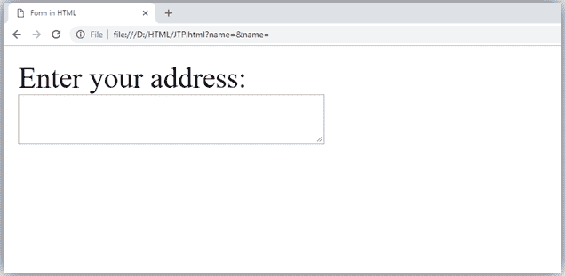

* * *

## 表单中的标签标签

形式上最好有标签。因为它使代码解析器/浏览器/用户友好。如果您单击标签标签，它将聚焦在文本控件上。为此，您需要标签标签中的 for 属性必须与输入标签的 id 属性相同。

#### 注意:带表单使用<label>标签是好的，虽然是可选的，但是如果你会使用它，那么当你点击或者点击标签标签时，它会提供一个焦点。用触摸屏更值得。</label>

```
<form>
    <label for="firstname">First Name: </label> <br/>
              <input type="text" id="firstname" name="firstname"/> <br/>
   <label for="lastname">Last Name: </label>
              <input type="text" id="lastname" name="lastname"/> <br/>
 </form>

```

**输出:**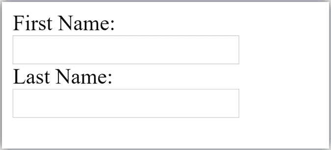

* * *

## HTML 密码字段控件

密码字段控件中的密码对用户不可见。

```
<form>
    <label for="password">Password: </label>
              <input type="password" id="password" name="password"/> <br/>
</form>

```

**输出:**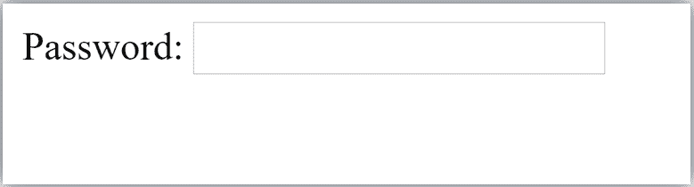

* * *

## HTML 5 电子邮件字段控制

HTML 5 中新的电子邮件字段。它验证文本中的电子邮件地址是否正确。您必须使用@和。在这个领域。

```
<form>
    <label for="email">Email: </label>
              <input type="email" id="email" name="email"/> <br/>
</form>

```

它将显示在浏览器中，如下所示: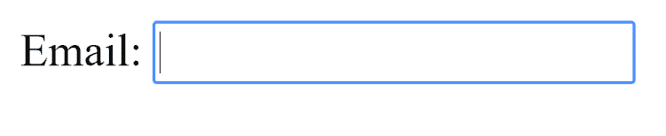

#### 注意:如果我们没有输入正确的电子邮件，它将显示如下错误:

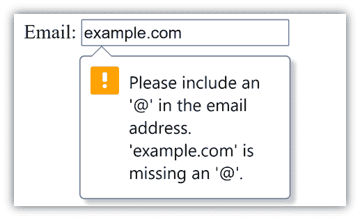

* * *

## 单选按钮控制

单选按钮用于从多个选项中选择一个选项。它用于选择性别、测验问题等。如果对所有单选按钮使用一个名称，一次只能选择一个单选按钮。使用单选按钮选择多个选项，一次只能选择一个选项。

```
<form>
    <label for="gender">Gender: </label>
              <input type="radio" id="gender" name="gender" value="male"/>Male
              <input type="radio" id="gender" name="gender" value="female"/>Female <br/>
</form>

```


* * *

## 复选框控件

复选框控件用于检查给定复选框中的多个选项。

```
<form>
Hobby:<br>
              <input type="checkbox" id="cricket" name="cricket" value="cricket"/>
                 <label for="cricket">Cricket</label> <br>
              <input type="checkbox" id="football" name="football" value="football"/>
                 <label for="football">Football</label> <br>
              <input type="checkbox" id="hockey" name="hockey" value="hockey"/>
                 <label for="hockey">Hockey</label>
</form>

```

#### 注意:这些类似于单选按钮，除了它可以一次选择多个选项，单选按钮可以一次选择一个按钮及其显示。

**输出:**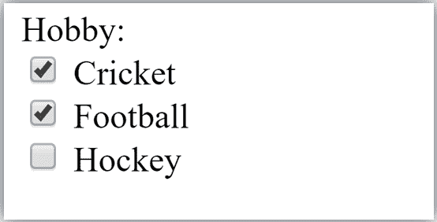

* * *

## 提交按钮控件

HTML **<输入类型=“提交”>** 用于在网页上添加提交按钮。当用户点击提交按钮时，表单提交到服务器。语法:

```
<input type="submit" value="submit">

```

type = submit，指定它是一个提交按钮值属性可以是我们写在网页按钮上的任何东西。这里可以省略名称属性。**示例:**

```
<form>
	<label for="name">Enter name</label><br>
	<input type="text" id="name" name="name"><br>
	<label for="pass">Enter Password</label><br>
	<input type="Password" id="pass" name="pass"><br>
	<input type="submit" value="submit">
</form>

```

**输出:**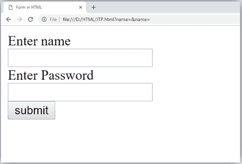

* * *

## HTML

<fieldset>元素:</fieldset>

HTML 中的

<fieldset>元素用于对表单的相关信息进行分组。该元素与为分组元素提供标题的<legend>元素一起使用。</legend></fieldset>

**示例:**

```
  <form>
      <fieldset>
  	  <legend>User Information:</legend>
  	<label for="name">Enter name</label><br>
	<input type="text" id="name" name="name"><br>
	<label for="pass">Enter Password</label><br>
	<input type="Password" id="pass" name="pass"><br>
	<input type="submit" value="submit">
 </fieldset>
</form>

```

**输出:**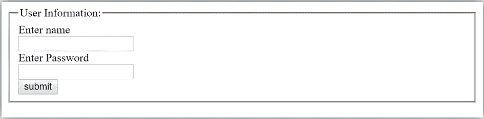

* * *

## HTML 表单示例

下面是一个简单注册形式的示例。

```
<!DOCTYPE html>
 <html>
 <head>
  <title>Form in HTML</title>
</head>
 <body>
	 <h2>Registration form</h2>
    <form>
  	 <fieldset>
  		<legend>User personal information</legend>
	    <label>Enter your full name</label><br>
	    <input type="text" name="name"><br>
	     <label>Enter your email</label><br>
	     <input type="email" name="email"><br>
	     <label>Enter your password</label><br>
	     <input type="password" name="pass"><br>
	     <label>confirm your password</label><br>
	     <input type="password" name="pass"><br>
	     <br><label>Enter your gender</label><br>
	     <input type="radio" id="gender" name="gender" value="male"/>Male  <br>
         <input type="radio" id="gender" name="gender" value="female"/>Female <br/>  
         <input type="radio" id="gender" name="gender" value="others"/>others <br/> 
          <br>Enter your Address:<br>
	     <textarea></textarea><br>
	     <input type="submit" value="sign-up">
	 </fieldset>
  </form>
 </body>
</html>

```

[Test it Now](https://www.javatpoint.com/oprweb/test.jsp?filename=htmlform2)**输出:**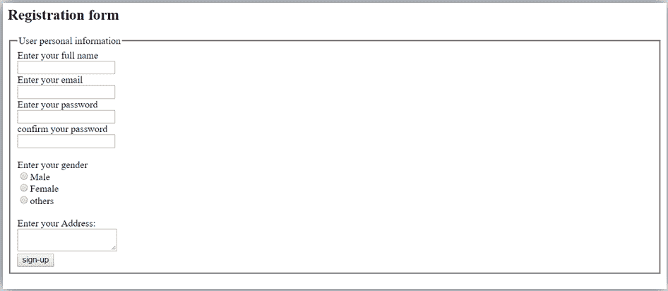

* * *

## HTML 表单示例

让我们看一个创建 HTML 表单的简单例子。

```
<form action="#">
<table>
<tr>
    <td class="tdLabel"><label for="register_name" class="label">Enter name:</label></td>
    <td><input type="text" name="name" value="" id="register_name" style="width:160px"/></td>
</tr>
<tr>
    <td class="tdLabel"><label for="register_password" class="label">Enter password:</label></td>
    <td><input type="password" name="password" id="register_password" style="width:160px"/></td>
</tr>
<tr>
    <td class="tdLabel"><label for="register_email" class="label">Enter Email:</label></td>
    <td
><input type="email" name="email" value="" id="register_email" style="width:160px"/></td>
</tr>
<tr>
    <td class="tdLabel"><label for="register_gender" class="label">Enter Gender:</label></td>
    <td>
<input type="radio" name="gender" id="register_gendermale" value="male"/>
<label for="register_gendermale">male</label>
<input type="radio" name="gender" id="register_genderfemale" value="female"/>
<label for="register_genderfemale">female</label>
    </td>
</tr>
<tr>
    <td class="tdLabel"><label for="register_country" class="label">Select Country:</label></td>
    <td><select name="country" id="register_country" style="width:160px">
    <option value="india">india</option>
    <option value="pakistan">pakistan</option>
    <option value="africa">africa</option>
    <option value="china">china</option>
    <option value="other">other</option>
</select>
</td>
</tr>
<tr>
    <td colspan="2"><div align="right"><input type="submit" id="register_0" value="register"/>
</div></td>
</tr>
</table>
</form>

```

[Test it Now](https://www.javatpoint.com/oprweb/test.jsp?filename=htmlform1)

* * *

## 支持浏览器

&#124; 元素 &#124; 铬 &#124;  IE &#124;  Firefox &#124; 歌剧 &#124;  Safari &#124;
&#124;  &#124; 是 &#124; 是 &#124; 是 &#124; 是 &#124; 是 &#124;

 |