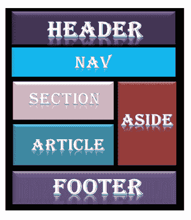

# HTML 布局

> 原文：<https://www.javatpoint.com/html-layout>

HTML 布局提供了一种以有礼貌的、结构化的和响应的形式排列网页的方式，或者我们可以说，HTML 布局指定了一种排列网页的方式。网页布局与 HTML 文档的视觉元素的排列一起工作。

**网页**布局是创建网站时需要牢记的最重要的部分，这样我们的网站才能以出色的外观显得专业。您还可以使用基于 CSS 和 JAVASCRIPT 的框架来创建响应性和动态网站设计的布局。



每个网站都有特定的布局，以特定的方式显示内容。

以下是用于定义网页不同部分的不同 HTML5 元素。

*   <header>:用于定义文档或章节的表头。</header>

*   <nav>:用于定义导航链接的容器</nav>

*   <section>:用于定义文档中的一个节</section>

*   <article>:用于定义独立的整篇文章</article>

*   <aside>:用来定义内容之外的内容(像侧边栏)</aside>

*   <footer>:用于定义文档或章节的页脚</footer>

*   <details>:用于定义附加细节</details>
*   <summary>:用于定义<details>元素的标题</details></summary>

#### 注意:HTML 布局为网页的每个部分创建了一个单独的空间。这样每个元素都可以按照一个重要的顺序排列。

## 各种布局元素的描述

### HTML

<header></header>

<header>元素用于创建网页的标题部分。标题包含介绍性内容、标题元素、网页的徽标或图标以及作者信息。</header>

### 示例:

```

<header style="background-color: #303030;  height: 80px; width: 100%">
      <h1 style="font-size: 30px; color: white;text-align: center; padding-top: 15px;">Welcome to     MyFirstWebpage</h1>
   </header>

```

[Test it Now](https://www.javatpoint.com/oprweb/test.jsp?filename=htmllayouts)

* * *

### HTML

<nav></nav>

<nav>元素是导航链接主块的容器。它可以包含同一页面或其他页面的链接。</nav>

### 示例:

```

<nav style="background-color:#bcdeef;">
		<h1 style="text-align: center;">Navgation Links</h1>
		<ul>
			<li><a href="#">link1</a></li>
			<li><a href="#">link2</a></li>
			<li><a href="#">link3</a></li>
			<li><a href="#">link4</a></li>
		</ul>
	</nav>

```

[Test it Now](https://www.javatpoint.com/oprweb/test.jsp?filename=htmllayouts2)

* * *

### HTML

HTML

<section>元素代表网页的一个独立部分，其中包含分组在一起的相关元素。它可以包含:文本、图像、表格、视频等。</section>

### 示例:

```

<section style="background-color:#ff7f50; width: 100%; border: 1px solid black;">
  	<h2>Introduction to HTML</h2>
  	<p>HTML is a markup language which is used for creating attractive web pages with the help of styling, and which looks in a nice format on a web browser..</p>
  </section>

```

[Test it Now](https://www.javatpoint.com/oprweb/test.jsp?filename=htmllayouts3)

* * *

### HTML

HTML

<article>标签用来包含一篇自成体系的文章，比如大故事、巨著等。</article>

### 示例:

```

<article style="width: 100%; border:2px solid black; background-color: #fff0f5;">
	<h2>History of Computer</h2>
	<p>Write your content here for the history of computer</p>
</article>

```

[Test it Now](https://www.javatpoint.com/oprweb/test.jsp?filename=htmllayouts4)

* * *

### HTML

HTML

<aside>定义与主要内容相关的旁注内容。

<aside>内容必须与主要内容相关。它可以作为网页主要内容的侧栏。</aside>

</aside>

### 示例:

```

<aside style="background-color:#e6e6fa">
  	<h2>Sidebar information</h2>
  	<p>This conatins information which will represent like a side bar for a webpage</p>
  </aside>

```

[Test it Now](https://www.javatpoint.com/oprweb/test.jsp?filename=htmllayouts5)

* * *

### HTML

HTML

<footer>元素定义了该文档或网页的页脚。它主要包含作者、版权、其他链接等信息。</footer>

### 示例:

```

<footer style="background-color: #f0f8ff; width: 100%; text-align: center;">
	<h3>Footer Example</h3>
	<p> Copyright 2018-2020\. </p>
</footer>

```

[Test it Now](https://www.javatpoint.com/oprweb/test.jsp?filename=htmllayouts6)

* * *

### HTML<details></details>

HTML

<details>元素用于添加关于网页的额外细节，可以根据需要隐藏或显示细节。</details>

### 示例:

```

<details style="background-color: #f5deb3">
 	<summary>This is visible section: click to show other details</summary>
 	<p>This section only shows if user want to see it. </p>
 </details>

```

[Test it Now](https://www.javatpoint.com/oprweb/test.jsp?filename=htmllayouts7)

* * *

### HTML<summary></summary>

HTML

<summary>元素与网页中的<details>元素一起使用。它用作<details>元素内容的摘要、说明文字。</details></details></summary>

### 示例:

```

<details>
 	<summary>HTML is acronym for?</summary>
 	<p style="color: blue; font-size: 20px;">Hypertext Markup Language</p>
 </details>

```

[Test it Now](https://www.javatpoint.com/oprweb/test.jsp?filename=htmllayouts8)