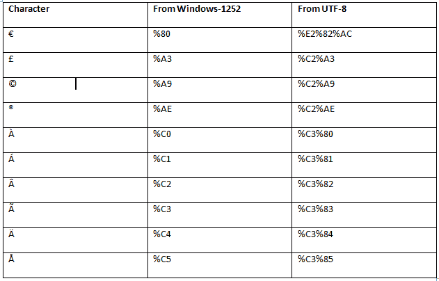

# 编码 HTML URL

> 原文：<https://www.javatpoint.com/html-url-encode>

## 什么是 URL？

网址代表统一资源定位器。它实际上是一个网址。网址可以包含单词(即 javatpoint.com)或互联网协议地址(即 195.201.68.81)。但大多数用户使用单词形式的网址，因为它比数字更容易记住。

**网址语法:**

```html

scheme://prefix.domain:port/path/filename

```

在这里，

*   **方案**用于定义互联网服务的类型(最常见的是 http 或 https)。
*   **前缀**用于定义域前缀(http 默认为 www)。
*   **域名**用于定义互联网域名(类似 javaTpoint.com)。
*   **端口**用于定义主机上的端口号(http 默认为 80)。
*   **路径**用于定义服务器端的路径(如省略:站点的根目录)。
*   **文件名**用于定义文档或资源的名称。

**以下是 URL 中使用的一些常见方案类型的列表:**

*   超文本传输协议:常见的网页。没有加密。
*   https(安全超文本传输协议):安全网页。加密的。
*   文件传输协议:下载或上传文件。
*   文件:计算机上的文件。

## 网址编码

网址编码用于将非 ASCII 字符转换为可在互联网上使用的格式，因为网址仅使用 ASCII 字符集在互联网上发送。如果网址包含 ASCII 集以外的字符，则必须转换该网址。

在网址编码中，非 ASCII 字符用“%”替换，后跟十六进制数字。

URL 不能包含空格。网址编码通常用加号(+)或%20 代替空格。

**以下是提交文本后浏览器编码的一些字符集列表。**

