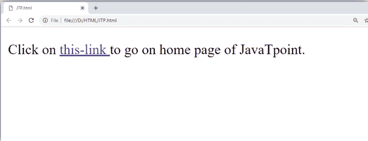

# HTML 锚

> 原文：<https://www.javatpoint.com/html-anchor>

**HTML 锚点标签**定义了*一个将一个页面链接到另一个页面的超链接*。它可以创建指向其他网页以及文件、位置或任何网址的超链接。“href”属性是 HTML 标记最重要的属性。以及指向目标页面或网址的链接。

## HTML 锚标记的 href 属性

href 属性用于定义要链接的文件的地址。换句话说，它指出了目标页面。

下面给出了 HTML 锚标签的语法。

```html
<a href = "..........."> Link Text </a>

```

让我们看一个 HTML 锚标签的例子。

```html
Click for Second Page

```

[Test it Now](https://www.javatpoint.com/oprweb/test.jsp?filename=htmlanchor1)

* * *

## 使用目标属性指定链接的位置

如果我们想打开另一个页面的链接，那么我们可以使用

## 示例:

```html
<!DOCTYPE html>
<html>
<head>
	<title></title>
</head>
<body>
<p>Click on <a href="https://www.javatpoint.com/" target="_blank"> this-link </a>to go on home page of JavaTpoint.</p>
</body>
</html>

```

[Test it Now](https://www.javatpoint.com/oprweb/test.jsp?filename=htmlAnchor1_2)

**输出:**



**注:**

*   **目标**属性只能与锚点标签中的 href 属性一起使用。
*   如果我们不使用目标属性，那么链接将在同一页面打开。

* * *

## HTML 锚标记的外观

一个**未访问的链接**以下划线和蓝色显示。

一个**访问的链接**显示下划线和紫色。

一个**活动链接**带下划线且为红色。

* * *

## 支持浏览器

| 元素 | 铬 |  IE |  Firefox | 歌剧 |  Safari |
|  | 是 | 是 | 是 | 是 | 是 |