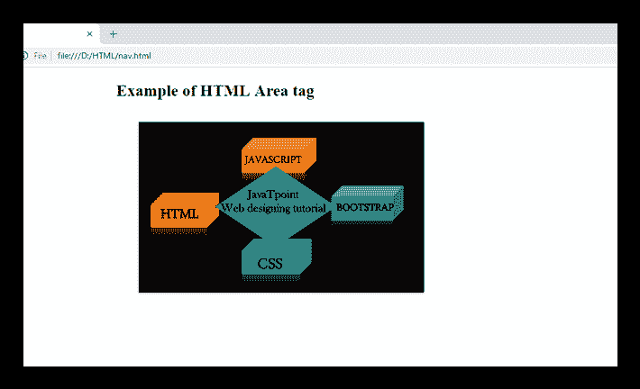

# HTML 标签

> 原文：<https://www.javatpoint.com/html-area-tag>

## 描述:

标签定义了图像地图中与超链接相关联的可点击区域或活动区域。如果你点击这些区域，它会执行一些动作，比如打开一个新的图像，新的网址，等等。该标签始终与<map>元素一起使用。</map>

在图像地图中，不同的区域可以使用单个<map>元素中的多个元素超链接到不同的位置。</map>

元素定义为(必需)属性**形状**和**坐标**。形状属性指定区域的形状，如**矩形**、**圆形**、**正方形**、**多边形**。coords 属性定义图像内部区域的坐标。

## 什么是图像地图

图像地图被定义为具有活动区域的图形图像，因此当用户点击这些区域时，它可以链接到不同的目的地。**要定义图像地图，我们需要以下东西:**

*   带有**的 HTML 元素使用定义有效地图名称的地图**属性。
*   名称为属性的<map>元素，其值必须与**相同，使用地图**</map>
*   一个<map>元素内的一个或多个元素，在图像地图中创建可点击区域。</map>

### 句法

```

    <area shape="" coords="" href="">

```

**以下是关于 HTML <区域>标签**的一些规范

| **显示** | **区块** |
| **开始标签/结束标签** | 仅开始标记(禁止结束标记) |
| 用法 | 图像映射 |

### 例子

```

<!DOCTYPE html>
<html>
 <head>
<title>HTML Area tag</title>
<style>
  body{
  margin-left: 250px;}
</style>
  </head>
 <body>
 <h2>Example of HTML Area tag</h2>

<map name="web">
<area shape="rect" coords="66,117,131,168" href="https://www.javatpoint.com/html-tutorial">
<area shape="rect" coords="199,36,277,85" href="https://www.javatpoint.com/css-tutorial">
<area shape="rect" coords="330,107,406,159" href="https://www.javatpoint.com/bootstrap-tutorial">
<area shape="rect" coords="199,185,267,236" href="https://www.javatpoint.com/javascript-tutorial">
 </map>
 </body>
</html>

```

[Test it Now](https://www.javatpoint.com/oprweb/test.jsp?filename=htmlareatag)



## 属性:

### 特定于标签的属性:

| 属性 | 价值 | 描述 |
| 中高音 | 文本 | 如果不显示图像，则在浏览器上显示的替代文本字符串。 |
| 坐标 | x1、y1、x2、y2(直线) | 定义矩形左上角和右下角的坐标。 |
| x，y，半径(圆) | 定义圆的坐标。 |
| x1，y1，x2，y2，x3，y3，-什么(多边形) | 定义多边形顶点。 |
| 超链接 | 超链接 | URLIt 确定活动区域的超链接目标。 |
| 目标 | _ 空白 | 在新窗口中打开链接 |
| 父项(_ p) | 打开父框架中的链接 |
| _self | 在当前窗口中打开链接 |
| _top | 在同一窗口中以全宽打开链接 |
| 框架名称 | 在相框里。**(html 5 不支持)** |
| 形状 | 系统默认值 | 它定义了默认区域(矩形)。 |
| 矩形 | 它定义了矩形区域。 |
| 圆 | 定义圆形区域。 |
| 聚酯的 | 定义多边形。 |
| 下载 | 文件名 | 定义用于下载资源的超链接。 |
| rel〔t0〕 | 候补
作者
书签
帮助
许可
下一个
no follow
no Ferrer
预取
prev
搜索
标签 | 它定义了当前文档和链接文档之间的关系。 |
| hreflag的缩写形式 | 语言代码 | 它指定链接资源的语言。 |
| 类型 | 媒体类型 | 它指定链接源的 MIME 类型。**(html 5 不支持)** |

### 全局属性:

标签支持 HTML 中的全局属性

### 事件属性:

标签支持 HTML 中的事件属性。

## 支持浏览器

| **元素** | 铬 |  IE |  Firefox | 歌剧 |  Safari |
| **<地区>** | 是 | 是 | 是 | 是 | 是 |