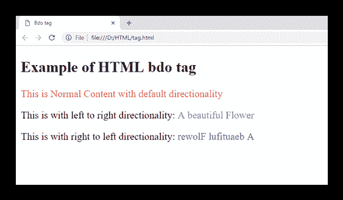

# HTML <bdo>标签</bdo>

> 原文：<https://www.javatpoint.com/html-bdo-tag>

HTML <bdo>标签代表“双向覆盖”，用于覆盖当前/默认文本方向。此标签设置内容在浏览器中从左到右或从右到左呈现的方向。</bdo>

<bdo>标记对于从右向左书写的语言很有用，例如阿拉伯语和希伯来语。</bdo>

### 句法

```html

<bdo dir=" "> Content......</bdo>

```

**以下是关于< bdo >标签**的一些规格

| **显示** | **直列** |
| **开始标签/结束标签** | 开始和结束标记 |
| 用法 | 本文的 |

### 例子

```html

<!DOCTYPE html>
<html>
<head>
	<title>Bdo tag</title>
 </head>
<body>
     <h2>Example of HTML bdo tag</h2>
     <p style="color:#ff4040">This is Normal Content with default directionality</p>
     <p>This is with left to right directionality:
         <bdo dir="ltr" style="color: #5f9ea0">A beautiful Flower</bdo>
     </p>
      <p>This is with right to left directionality:
         <bdo dir="rtl" style="color:#68228b">A beautiful Flower</bdo>
      </p>
 </body>
</html>

```

[Test it Now](https://www.javatpoint.com/oprweb/test.jsp?filename=HTMLbdotag)

**输出:**



## 属性

**标签特定属性**

| 属性 | 价值 | 描述 |
| 目录 |
|  | 符号 | 定义从左到右的方向。 |
|  | 电阻晶体管逻辑 | 定义从右向左的方向。 |

## 全局属性

<bdo>标签支持 HTML 中的全局属性。</bdo>

## 事件属性

<bdo>标签支持 HTML 中的事件属性。</bdo>

## 支持浏览器

| **元素** | 铬 |  IE |  Firefox | 歌剧 |  Safari |
| **<【bdo】>** | 是 | 是 | 是 | 是 | 是 |