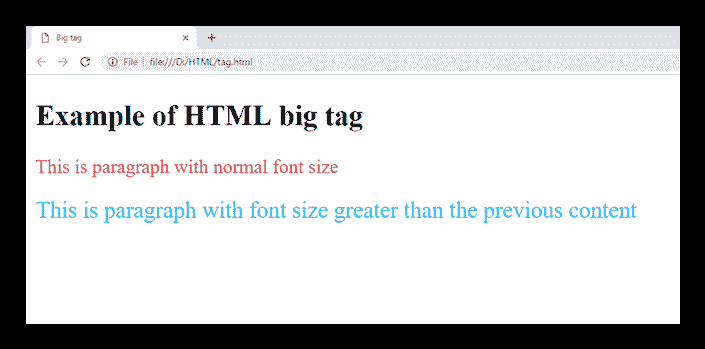
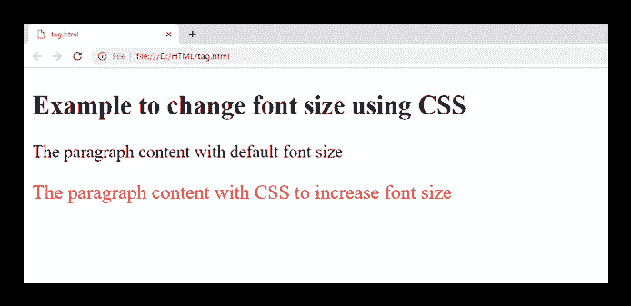

# HTML <big>标签(HTML5 不支持)</big>

> 原文：<https://www.javatpoint.com/html-big-tag>

HTML <big>标签用于将文本字体大小比文档的基本字体大小或周围文本大小大一级，如小到中、中到大等。</big>

#### 注意:HTML <big>标签不再受 HTML5 支持，可以使用 CSS 增加字体大小。</big>

### 句法

```html

<big>Content... </big>

```

**以下是关于<大>标签**的一些规格

| **显示** | **直列** |
| **开始标签/结束标签** | 开始和结束标记 |
| 用法 | 字体和网页排版 |

### 例子

```html

 <!DOCTYPE html>
 <html>
 <head>
   <title>Big tag</title>
 </head>
 <body>
   <h2>Example of HTML big tag</h2>
    <p style="color:#ff4040">This is paragraph with normal font size</p>
    <p style="color:#00bfff">
        <big>This is paragraph with font size greater than the previous content</big>
    </p>
  </body>
</html>

```

[Test it Now](https://www.javatpoint.com/oprweb/test.jsp?filename=HTMLbigtag)

**输出:**



## 使用 CSS 属性增加字体大小:

```html

<!DOCTYPE html>
<html>
<head>
	<style>
	      .fsize{
		font-size: 18px;
		color: red;
		}
	</style>
</head>
<body>
	<h2>Example to change font size using CSS</h2>
	<p>The paragraph content with default font size</p>
	<p class="fsize">The paragraph content with CSS to increase font size</p>
</body>
</html>

```

[Test it Now](https://www.javatpoint.com/oprweb/test.jsp?filename=HTMLbigtag2)

**输出:**



## 属性

**标签特定属性:**

<big>元素不包含任何特定属性。</big>

## 全局属性

<big>元素支持 HTML 中的全局属性。</big>

## 支持浏览器

| **元素** | 铬 |  IE |  Firefox | 歌剧 |  Safari |
| **<大>** | 是 | 是 | 是 | 是 | 是 |