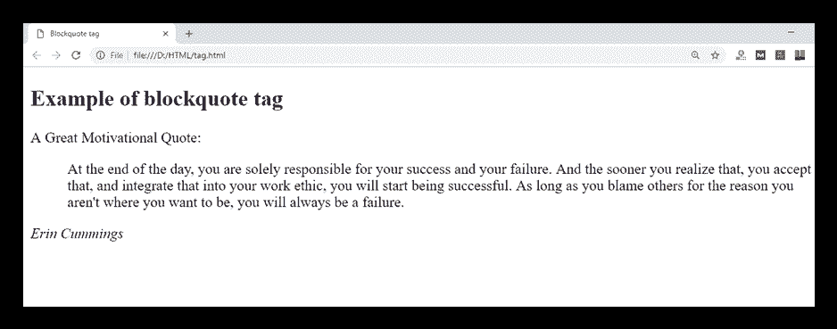
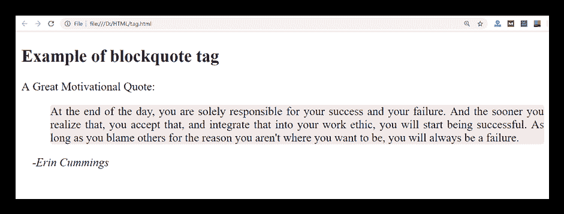

# HTML

> label

> 原文：<https://www.javatpoint.com/html-blockquote-tag>

HTML

> Tags are used to define text blocks that are referenced from another source. The browser usually displays the contents of the
> 
> > tag as indented text.

如果你想插入一个长引号，那么使用

> , for short quotation marks or embedded quotation marks, use the <q>mark.</q>

### 句法

```

<blockquote> quoted text......</blockquote>

```

**以下是关于<区块报价>标签**的一些规格

| 显示 | 街区 |
| 开始标记/结束标记 | 开始和结束标记 |
| 使用 | 语义/文本 |

### 例子

```

<!DOCTYPE html>
<html>
<head>
	<title>Blockquote tag</title>
</head>
<body>
	<h2>Example of blockquote tag</h2>
	<p>A Great Motivational Quote :</p>
   <blockquote cite="https://www.brainyquote.com/authors/erin_cummings">
   	<p>
	 At the end of the day, you are solely responsible for your success and your failure. And the sooner you realize that, you accept that, and integrate that into your work ethic, you will start being successful. As long as you blame others for the reason you aren't where you want to be, you will always be a failure.
	 </p>
   </blockquote>
<cite>Erin Cummings</cite>
</body>
</html>

```

[Test it Now](https://www.javatpoint.com/oprweb/test.jsp?filename=HTMLblockquotetag)

**输出:**



## 样式

> label

```

<!DOCTYPE html>
<html>
<head>
	<title>Blockquote tag</title>
   <style>
   	blockquote{
   		text-align: justify;
   		background-color: #F7EAE9;
                           border-radius: 4px;
                           margin-right: 25px;}
   	cite{
   	  margin-left: 15px;}
   </style>
</head>
<body>
	<h2>Example of blockquote tag</h2>
	<p>A Great Motivational Quote:</p>
   <blockquote cite="https://www.brainyquote.com/authors/erin_cummings">
   	<p>
	 At the end of the day, you are solely responsible for your success and your failure. And the sooner you realize that, you accept that, and integrate that into your work ethic, you will start being successful. As long as you blame others for the reason you aren't where you want to be, you will always be a failure.
	 </p>
   </blockquote>
<cite>-Erin Cummings</cite>
</body>
</html>

```

[Test it Now](https://www.javatpoint.com/oprweb/test.jsp?filename=HTMLblockquotetag2)

#### 注意:我们使用了 CSS 属性 margin-right: 25px 来更改应用于文本的缩进。您也可以使用左边距或边距速记属性。

**输出:**



## 属性

### 标签特定属性

| 属性 | 价值 | 描述 |
| 引用 | 统一资源定位器 | 它用于指定报价来源的网址。 |

### 全局属性

> All global attributes in tag HTML are supported.

### 事件属性

> All event attributes in tag HTML are supported.

## 支持浏览器

| **元素** | 铬 |  IE |  Firefox | 歌剧 |  Safari |
| **<封锁>** | 是 | 是 | 是 | 是 | 是 |