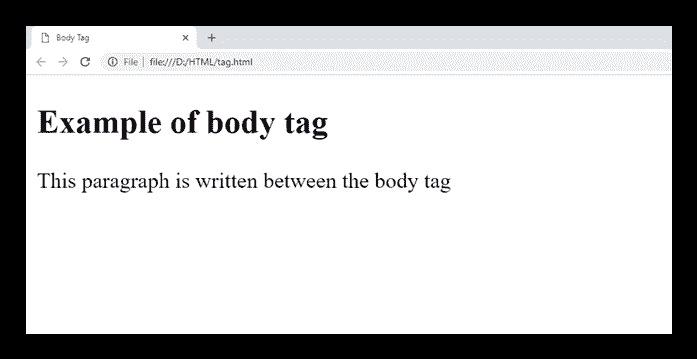

tag <link href="../Styles/Style.css" type="text/css" rel="stylesheet">

# HTML 标记

> 原文:[https://www.javatpoint.com/html-body-tag](https://www.javatpoint.com/html-body-tag)

HTML 标签定义了显示在浏览器上的 HTML 文档的主要内容。它可以包含文本内容、段落、标题、图像、表格、链接、视频等。

必须是标签后的第二个元素，否则应放在和标签之间。每个 HTML 文档都需要这个标签，并且在整个 HTML 文档中只能使用一次。

### 句法

```

<body> Place your Content here........</body>

```

**以下是关于<车身>标签**的一些规格

| **显示** | **直列** |
| **开始标签/结束标签** | 开始和结束标记 |
| 用法 | 结构的 |

### 例子

```

<!DOCTYPE html>
<html>
<head>
 <title>Body Tag</title>
</head>
<body>
 <h2>Example of body tag</h2>
 <p>This paragraph is written between the body tag</p>
</body>
</html>

```

[Test it Now](https://www.javatpoint.com/oprweb/test.jsp?filename=HTMLbodytag)

**输出:**



## 属性

### 标签特定属性

| 属性 | 价值 | 描述 |
| 当前激活的连接的文字颜色 | 颜色 | 它定义文档中活动链接的颜色。(HTML5 中不支持) |
| 背景 | 统一资源定位器 | 它决定了文档的背景图像。(HTML5 中不支持) |
| bgcolor(bgcolor) | 颜色 | 它决定了内容的背景颜色。(HTML5 中不支持) |
| 环 | 颜色 | 它决定了未访问链接的颜色。(HTML5 中不支持) |
| 文本 | 颜色 | 它决定了文档中文本的颜色。(HTML5 中不支持) |
| 我们的贵宾 | 颜色 | 它决定了被访问链接的颜色。(HTML5 中不支持) |
| 装载 |  | 页面加载时的函数调用 |
| 和他一起上传 |  | 用户离开页面时的函数调用 |
| 得到焦点时 |  | 当文档被用户聚焦时的函数调用。 |
| onblur(声音) |  | 用户使文档失去焦点时的函数调用。 |

### 全局属性

属性支持 HTML 中的全局属性。

### 事件属性

属性支持 HTML 中的事件属性。

## 支持浏览器

| **元素** | 铬 |  IE |  Firefox | 歌剧 |  Safari |
| **<体>** | 是 | 是 | 是 | 是 | 是 |