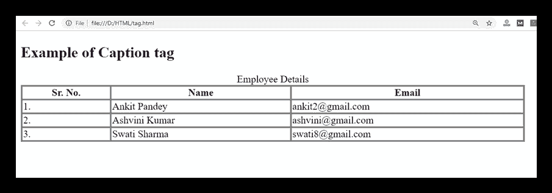

# HTML 标签

> 原文：<https://www.javatpoint.com/html-caption-tag>

HTML 标签用于添加 HTML 表格的标题或题注。它应该在元素中使用，并且刚好在

开始标记之后。一个表只能包含一个

<caption>元素。</caption>

### 句法

```

<caption>Table title...</caption>

```

**以下是关于<标题>标签**的一些说明

| **显示** | **直列** |
| **开始标签/结束标签** | 开始和结束标记 |
| 用法 | 本文的 |

### 例 1

```

<!DOCTYPE html>
<html>
<head>
	<title>Caption Tag</title>
	<style>
		table, td, th {
        border: 3px solid gray;
        border-collapse: collapse;}
	</style>
 </head>
 <body>
    <h2>Example of Caption tag</h2>
   <table width="800">
	  <caption>Employee Details</caption>
      <thead>
     	<tr>
     		<th>Sr. No.</th>
     		<th>Name</th>
     		<th>Email</th>
     	  </tr>
        </thead>
       <tbody>
    	<tr>
    		<td>1.</td>
    		<td>Ankit Pandey</td>
    		<td>ankit2@gmail.com</td>
    	</tr>
    	<tr>
    		<td>2.</td>
    		<td>Ashvini Kumar</td>
    		<td>ashvini@gmail.com</td>
    	</tr>
    	<tr>
    		<td>3.</td>
    		<td>Swati Sharma</td>
    		<td>swati8@gmail.com</td>
    	</tr>
    </tbody>
</table>
</body>
</html>

```

[Test it Now](https://www.javatpoint.com/oprweb/test.jsp?filename=HTMLcaptiontag)

**输出:**



## 属性

### 特定于标签的属性

| 属性 | 价值 | 描述 |
| 排列 | 

*   top
*   bottom
*   the left side
*   right

 | 它使标题相对于表格对齐 |

### 全局属性

标签支持全局属性

### 事件属性

标签支持事件属性。

## 支持浏览器

| **元素** | 铬 |  IE |  Firefox | 歌剧 |  Safari |
| **<字幕>** | 是 | 是 | 是 | 是 | 是 |