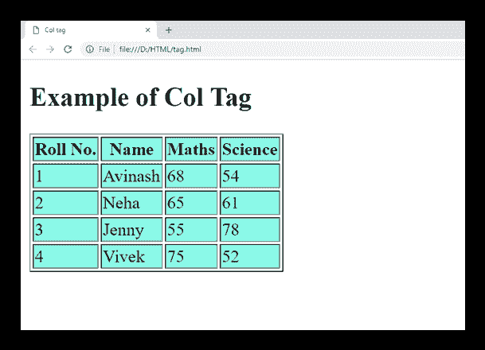

# HTML 标签

> 原文：<https://www.javatpoint.com/html-col-tag>

HTML 标签用于为 HTML 表格中元素内的每一列指定公共列属性。

当需要为每个列单元格应用通用样式规则而不是单独应用时，标记非常有用。

### 句法

```

<col span=" "   style=" ">

```

#### 注意:在 HTML 中标签不需要结束标签，但是在 XHTML 中它需要结束标签。

**以下是关于 HTML <栏>标签**的一些规范

| **显示** | **直列** |
| **开始标签/结束标签** | 开始标记(空标记) |
| 用法 | HTML 表格 |

### 例 1

```

<!DOCTYPE html>
<html>
<head>
	<title>Col tag</title>
</head>
<body>
<h2>Example of Col Tag</h2>
<table border="1">
	<colgroup>
		<col  span="2" style="background-color: #7fffd4">
		<col span="2" style="background-color: 	#98f5ff">
	</colgroup>
	<tr>
		<th>Roll No.</th>
		<th>Name</th>
		<th>Maths</th>
		<th>Science</th>
	</tr>
	<tr>
		<td>1</td>
		<td>Avinash</td>
		 <td>68</td>
		 <td>54</td>
	</tr>
	<tr>
		<td>2</td>
		<td>Neha</td>
		 <td>65</td>
		 <td>61</td>
	</tr>
	<tr>
		<td>3</td>
		<td>Jenny</td>
		 <td>55</td>
		 <td>78</td>
	</tr>
	<tr>
		<td>4</td>
		<td>Vivek</td>
		 <td>75</td>
		 <td>52</td>
	</tr>
</table>
</body>
</html>

```

[Test it Now](https://www.javatpoint.com/oprweb/test.jsp?filename=htmlcoltag)

**输出:**



## 属性:

**标签特定属性**

元素应该包含的列数。span 属性的默认值为 1。

| 属性 | 价值 | 描述 |
| 排列 | 

*   the left side
*   middle
*   right
*   identify and rectify names of sb or sth
*   Char

 | 它指定每个列单元格的水平对齐方式。
(html 5 不支持)。 |
| 茶 | 性格；角色；字母 | 它根据列中的字符指定内容的对齐方式。如果 align 未设置为 char，它将被忽略。(HTML5 中不支持)。 |
| 查洛夫 | 数字 | 它设置字符数，使列数据偏离由 char 属性指定的对齐字符。(HTML5 中不支持)。 |
| 跨度 | 数字 | 它指定了 |<colgroup><col></colgroup>
| 瓦伦 | 

*   top
*   middle
*   bottom
*   base

 | 它指定列的垂直对齐方式。
(html 5 不支持)。 |
| 宽度 | 

*   %
*   pixel
*   Relative _ length

 | 它指定列的宽度。
(html 5 不支持)。 |

## 全局属性

HTML 标签支持 HTML 中的所有全局属性。

## 事件属性

HTML 标签支持 HTML 中的所有事件属性。

## 支持浏览器

| **元素** | 铬 |  IE |  Firefox | 歌剧 |  Safari |
| **<山坳>** | 是 | 是 | 是 | 是 | 是 |