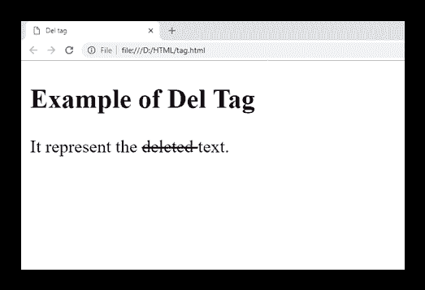
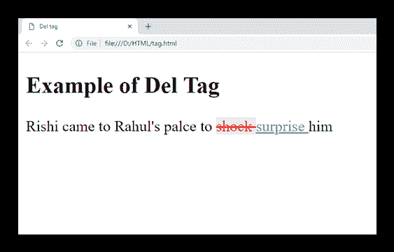

# HTML ~~标签~~

> 吴奇珍:t0]https://www . javatppoint . com/html-del 标记

HTML ~~标签用于表示已经从文档中删除/移除的文本范围。它用作已删除内容的标记。浏览器通常通过在删除的文本中划一条线来呈现它，尽管这可以使用 CSS 属性进行更改。~~

#### 注意:要识别删除的文本和插入的文本，请使用带有~~的<ins>标签，该标签将在文档中显示删除的和插入的文本。</ins>~~

### 句法

```html

<del> Content........</del>

```

**以下是关于 HTML < del >标签**的一些规范

| **显示** | **直列** |
| **开始标签/结束标签** | 开始和结束标签 |
| 用法 | 本文的 |

### 例 1

```html

<!DOCTYPE html>
<html>
<head>
<title>Del tag</title>
</head>
<body>
<h2>Example of Del Tag</h2>
<p>It represent the <del> deleted </del> text. </p>
</body>
</html>

```

[Test it Now](https://www.javatpoint.com/oprweb/test.jsp?filename=htmldeltag)

**输出:**



### 例 2

使用 CSS 和<ins>标签</ins>

```html

<!DOCTYPE html>
<html>
<head>
<title>Del tag</title>
<style>
	del{
		color: red;
		background-color: #fde1e5;}
   ins{
       color:#16c39a;}
</style>
</head>
<body>
<h2>Example of Del Tag</h2>
<p>Rishi came to Rahul's palce to <del>shock </del> <ins> surprise </ins> him</p>
</body>
</html>

```

[Test it Now](https://www.javatpoint.com/oprweb/test.jsp?filename=htmldeltag2)

**输出:**



## 属性

| 属性 | 价值 | 描述 |
| 引用 | 统一资源定位器 | 它指定资源的网址，解释删除文本的改变或原因。 |
| 日期时间 | YYYY-MM-DDThh：mm：ssTZD | 它指定删除文本的日期和时间。 |

## 全局属性

HTML ~~标签支持全局属性。~~

## 事件属性

HTML ~~标签支持事件属性。~~

## 支持浏览器

| **元素** | 铬 |  IE |  Firefox | 歌剧 |  Safari |
| >的< del >的 | 是 | 是 | 是 | 是 | 是 |