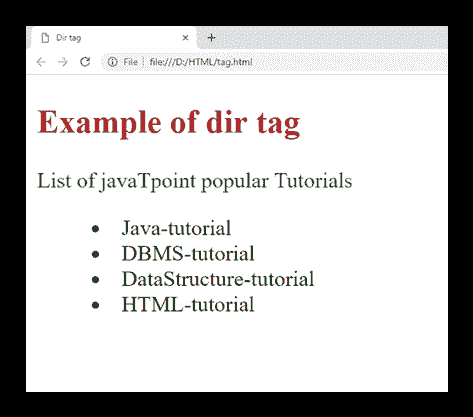

# HTML

<dir>标签(HTML5 不支持)</dir>

> 噻:[https://www . javatppoint . com/html-dir 标签](https://www.javatpoint.com/html-dir-tag)

HTML

<dir>标签被用作目录中文件/文件夹或内容列表的容器。

<dir>元素与*   Tag, by default, the table of contents list is presented by bullets.</dir>

</dir>

#### 注意:不要使用 HTML

<dir>标记，因为它现在已被弃用，并且在 HTML5 中不受支持。可以用</dir>

### 句法

```html

<dir>Directory list... </dir>

```

**以下是关于 HTML <目录>标签**的一些规范

| **显示** | **区块** |
| **开始标签/结束标签** | 开始和结束标签 |
| 用法 | HTML 列表 |

### 例 1

```html

<!DOCTYPE html>
<html>
<head>
	<title>Dir tag</title>
	<style>
		h2{
		    color: #b22222;}
		p{
		   color: green;}
	</style>
 </head>
<body>
  <h2>Example of dir tag</h2>
  <p>List of javaTpoint popular Tutorials</p>
    <dir>
	<li>Java-tutorial</li>
	<li>DBMS-tutorial</li>
	<li>DataStructure-tutorial</li>
	<li>HTML-tutorial</li>
   </dir>
 </body>
</html>

```

[Test it Now](https://www.javatpoint.com/oprweb/test.jsp?filename=htmldirtag)

**输出:**



## 属性

## 特定于标签的属性

| 属性 | 价值 | 描述 |
| 紧密的 | 紧密的 | 它指定列表应显示得比正常情况小。(HTML5 中不支持) |

## 全局属性

HTML

<dir>标签支持全局属性。</dir>

## 事件属性

HTML

<dir>标签支持事件属性。</dir>

## 支持浏览器

| **元素** | 铬 |  IE |  Firefox | 歌剧 |  Safari |
| **< 说 >** | 是 | 是 | 是 | 是 | 是 |