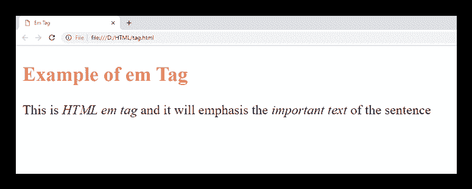

# HTML *标签*

> 噻:[https://www . javatppoint . com/html-em-tag](https://www.javatpoint.com/html-em-tag)

HTML *标签用于强调句子或短语中的特定文本。它为包含在其中的文本赋予语义含义，并在浏览器上以斜体形式呈现。*

### 句法

```html

<em>Write Important content here.....</em>

```

**以下是关于 HTML < em >标签**的一些规范

| **显示** | 在一条直线上的 |
| **开始标签/结束标签** | 开始和结束标签 |
| 用法 | 本文的 |

### 例子

```html

<!DOCTYPE html>
<html>
<head>
<title>Em Tag</title>
    <style>
	      h2{
	            color:#ff7f50;
                          }
 </style>
 </head>
 <body>
 <h2>Example of em Tag</h2>
 <p>This is <em>HTML em tag</em> and it will emphasis the <em>important text</em> of the sentence</p>
</body>
</html>

```

[Test it Now](https://www.javatpoint.com/oprweb/test.jsp?filename=htmlemtag)

**输出:**



## 属性

## 特定于标签的属性

*标签在 HTML 中不包含任何特定属性。*

## 全局属性

*标签支持 HTML 中的全局属性*

## 事件属性

HTML *标签支持 HTML 中的事件属性。*

## 支持浏览器

| **元素** | 铬 |  IE |  Firefox | 歌剧 |  Safari |
| **<在>** 中 | 是 | 是 | 是 | 是 | 是 |