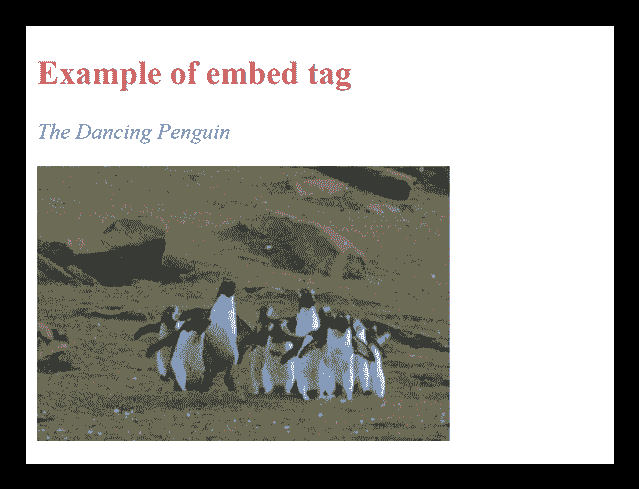

# HTML <embed>标签

> 原文：<https://www.javatpoint.com/html-embed-tag>

HTML <embed>标签用于在 HTML 文件中嵌入外部文档，可以是第三方应用、多媒体、插件(交互内容)等。这个元素在 HTML5 中是新的。

#### 注意:<embed>元素可以用于包含第三方应用程序以及多媒体文档，但是在 HTML5 中，新添加的

<audio>和<video>元素特别用于在 HTML 文档中嵌入多媒体。</video></audio>

### 句法

```html

<embed src=" " ></embed> 

```

**以下是关于 HTML <嵌入>标签**的一些规范

| **显示** | **区块** |
| **开始标签/结束标签** | 开始和结束标签 |
| 用法 | 嵌入第三方应用程序 |

### 例 1

```html

<!DOCTYPE html>
<html>
<head>
<title>Embed Tag</title>
<style>
	h2{
	color: #cd5c5c;}
	p{
	color: #20b2aa;
	font-style: italic;}
 </style>
</head>
<body>
<h2>Example of embed tag</h2>
<p>The Dancing Penguin</p>
<embed src="giphy.gif" height="200" width="300"></embed>
</body>
</html>

```

[Test it Now](https://www.javatpoint.com/oprweb/test.jsp?filename=htmlembedtag)

**输出:**



## 属性

## 特定于标签的属性

| 属性 | 价值 | 描述 |
| 高度 | 像素 | 它指定了嵌入内容的高度 |
| 科学研究委员会 | 统一资源定位器 | 它定义嵌入文档的资源位置。 |
| 类型 | 媒体类型 | 它指定了 MIME 类型。 |
| 宽度 | 像素 | 它决定嵌入内容的宽度。 |

## 全局属性

<embed>标签支持 HTML 中的全局属性

## 事件属性

<embed>标签支持 HTML 中的事件属性。

## 支持浏览器

| **元素** | 铬 |  IE |  Firefox | 歌剧 |  Safari |
| **<嵌入>** | 是 | 是 | 是 | 是 | 是 |