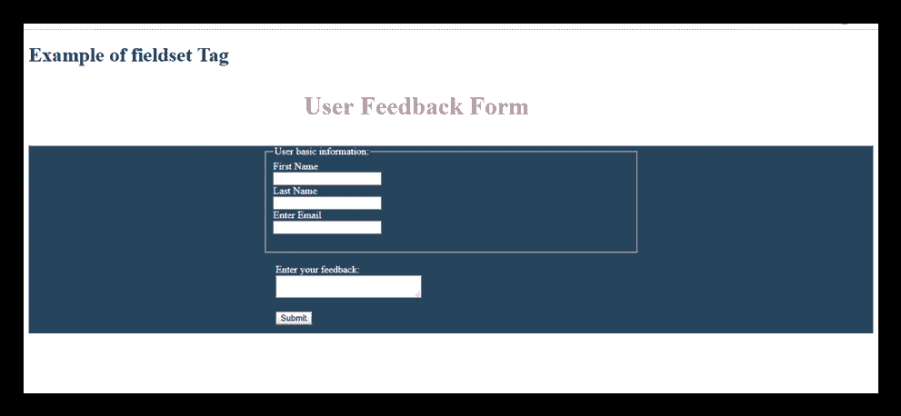

# HTML

<fieldset>tag

> 原文：<https://www.javatpoint.com/html-fieldset-tag>

HTML

<fieldset>标签用于对 HTML 表单中包含的逻辑相关的字段/标签进行分组。</fieldset>

创建一个 HTML 表单时，这个标签的使用是可选的，但是使用<filedset>，很容易理解表单分组元素的目的。</filedset>

<legend>标签与</legend>

<fieldset>元素一起用作第一个子元素，以定义分组相关字段的标题。</fieldset>

### 句法

```

<fieldset>.....</fieldset>

```

**以下是关于 HTML <字段集>标签**的一些规范

| **显示** | **区块** |
| **开始标签/结束标签** | 开始和结束标签 |
| 用法 | 结构化(在 HTML 表单中) |

### 例 1

```

<!DOCTYPE html>
<html>
<head>
<title>fieldset Tag</title>
<style>
	p{
	   color: #db7093;
	   margin-left: 440px;
	   font-size: 40px;
	   font-weight: bold;
		}
	form{
             color: white;
	width: 600px;
             height: 300px;
	margin: auto;
	margin-top: 30px;}
	div{
	background-color: #28455e;
		}
                  .tx{
	margin-left: 20px;
		}
</style>
</head>
<body>
 <h1>Example of fieldset Tag</h1>
 <p>User Feedback Form</p>
 <div>
 <form class="wd">
	 <fieldset class="wd">
		<legend>User basic information:</legend>
		<label>First Name</label><br>
		<input type="text" name="fname"><br>
		<label>Last Name</label><br>
		<input type="text" name="lname"><br>
		<label>Enter Email</label><br>
		<input type="email" name="email"><br><br>
     </fieldset><br>
	<label class="tx">Enter your feedback:</label><br>
	<textarea class="tx" cols="30"></textarea><br><br>
	 <input  class="tx" type="Submit"><br>
  </form>
 </div>
</body>
</html>

```

[Test it Now](https://www.javatpoint.com/oprweb/test.jsp?filename=htmlfieldsettag)

**输出:**



## 属性

= html 5 中新增。

### 特定于标签的属性

| 属性 | 价值 | 描述 |
| 禁用 | 有缺陷的 | 它指定禁用 fieldset 元素中的所有表单控件。 |
| 表格 | 表单 id | 它指定 fieldset 控件所属的一个或多个窗体。 |
| 名称 | 文本 | 它指定与 fieldset 关联的名称。它不会显示在浏览器中，对 JS 很有用。 |

### 全局属性

HTML < fieldset >标签支持 HTML 中的全局属性

### 事件属性

HTML < fieldset >标签支持 HTML 中的事件属性。

## 支持浏览器

| **元素** | 铬 |  IE |  Firefox | 歌剧 |  Safari |
| **<字段集>** | 是 | 是 | 是 | 是 | 是 |

</fieldset>