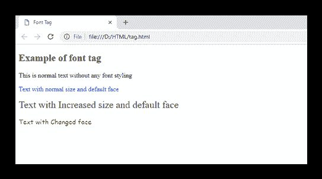
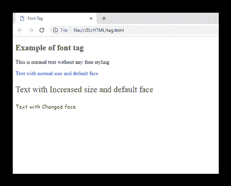

# HTML <font>标签(HTML5 不支持)</font>

> 哎哎哎:# t0]https://www . javatppoint . com/html 字体标记

HTML <font>标签用于定义其中包含的文本的字体样式。它定义了 HTML 文档中的字体大小、颜色和字体或文本。</font>

#### 注意:不要使用 HTML <font>标签，因为它在 HTML5 中已被弃用，所以您可以使用 CSS 属性来更改字体大小、字体、颜色等。</font>

### 句法

```html

<font size=" " color=" " face=" "> Content....</font>

```

**以下是关于 HTML <字体>标签**的一些规范

| **显示** | **直列** |
| **开始标签/结束标签** | 开始和结束标签 |
| 用法 | 字体样式 |

### 例 1

```html

<!DOCTYPE html>
 <html>
 <head>
 <title>Font Tag</title>
 </head>
 <body>
 <h2>Example of font tag</h2>
 <p>This is normal text without any font styling</p>
  <p>
	<font color="blue">Text with normal size and default face</font>
  </p>
  <p>
	<font size="5" color="green">Text with Increased size and default face</font>
  </p>
  <p>
	<font color="red" face="cursive">Text with Changed face</font>
  </p>
</body>
</html>

```

[Test it Now](https://www.javatpoint.com/oprweb/test.jsp?filename=htmlfonttag)

**输出:**



### 使用 CSS

使用 CSS 属性可以达到相同的效果，如下例所示:

```html

<!DOCTYPE html>
 <html>
 <head>
 <title>Font Tag</title>
 </head>
 <body>
<h2>Change font using CSS</h2>
 <p>This is normal text without any font styling</p>
 <p style="color: blue;">Text with normal size and default face</p>
 <p style="font-size: 25px; color: green;">Text with Increased size and default face </p>
 <p style="font-family: cursive; color: red;">Text with Changed face</p>
</body>
</html>

```

[Test it Now](https://www.javatpoint.com/oprweb/test.jsp?filename=htmlfonttag2)

**输出:**



## 属性

### 特定于标签的属性

| 属性 | 价值 | 描述 |
| codol(密码锁) | rgb(X，x，X)
#xxxxx
color_name | 它指定内容的颜色。(HTML5 中不支持) |
| 脸 | 字体系列 | 它指定内容的字体。(HTML5 中不支持) |
| 大小 | 数字 | 它指定内容的大小。(HTML5 中不支持) |

## 支持浏览器

| **元素** | 铬 |  IE |  Firefox | 歌剧 |  Safari |
| **<字体>** | 是 | 是 | 是 | 是 | 是 |