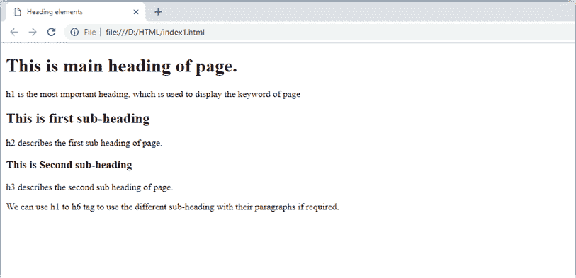

# HTML 标题

> 原文:[https://www.javatpoint.com/html-heading](https://www.javatpoint.com/html-heading)

一个 HTML 标题或 HTML h 标签可以被定义为你想在网页上显示的标题或副标题。当你把文本放在标题标签内

# .........

，它以粗体格式显示在浏览器上，文本的大小取决于标题的数量。

有六个不同的 HTML 标题，从最高级别 h1(主标题)到最低级别 h6(最不重要的标题)用

# 到

###### 标记定义。

h1 是最大的标题标签，h6 是最小的标题标签。所以 h1 用于最重要的航向，h6 用于最不重要的航向。

**HTML 中的标题有助于搜索引擎理解和索引网页的结构。**

#### 注意:网页整体内容的主关键词应该用 h1 标题标签显示。

请看这个例子:

```
标题 1
标题 2
标题 3
标题 4
标题 5
标题 6

```

[Test it Now](https://www.javatpoint.com/oprweb/test.jsp?filename=htmlheading1)

**输出:**

# 标题 1

## 标题 2

### 标题 3

#### 标题 4

##### 标题 5

###### 标题 6

#### 标题元素(h1....h6)只能用于标题。它们不应该仅用于使文本加粗或变大。

*   **HTML 标题也可以和嵌套元素一起使用。以下是显示标题元素使用方法的不同代码。**

**示例:**

```
<!DOCTYPE html>
<html>
 <head>
	<title>Heading elements</title>
 </head>
 <body>
	 <h1>This is main heading of page. </h1>
	  <p>h1 is the most important heading, which is used to display the keyword of page </p>
	 <h2>This is first sub-heading</h2>
	  <p>h2 describes the first sub heading of page. </p>
	 <h3>This is Second sub-heading</h3>
	  <p>h3 describes the second sub heading of page.</p>
	  <p>We can use h1 to h6 tag to use the different sub-heading with their paragraphs if       
                     required. 
                </p>
   </body>
</html>

```

**输出:**



* * *

## 支持浏览器

| 元素 | 铬 |  IE |  Firefox | 歌剧 |  Safari |
| 

# 至

 | 是 | 是 | 是 | 是 | 是 |

* * *