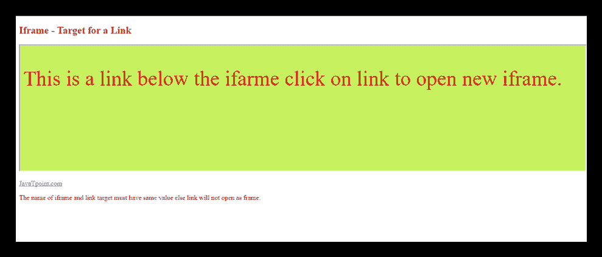

# HTML iframes

> 原文:[https://www.javatpoint.com/html-iframes](https://www.javatpoint.com/html-iframes)

HTML Iframe 用于显示嵌套网页(网页中的网页)。HTML <iframe>标签定义了一个内嵌框架，因此它也被称为内嵌框架。</iframe>

HTML iframe 在矩形区域的当前 HTML 文档中嵌入另一个文档。

网页内容和 iframe 内容可以使用 JavaScript 相互交互。

### Iframe 语法

一个 HTML iframe 是用<iframe>标签定义的:</iframe>

```

<iframe src="URL"></iframe>

```

这里，“src”属性指定内联框架页面的网址(URL)。

## 设置 iframe 的宽度和高度

您可以使用“宽度”和“高度”属性来设置 iframe 的宽度和高度。默认情况下，属性值以像素为单位指定，但您也可以以百分比为单位进行设置。即 50%、60%等。

### 示例:(像素)

```

<!DOCTYPE html>  
<html>  
<body>  
<h2>HTML Iframes example</h2>  
<p>Use the height and width attributes to specify the size of the iframe:</p>  
<iframe src="https://www.javatpoint.com/" height="300" width="400"></iframe>  
</body>  
</html>

```

[Test it Now](https://www.javatpoint.com/oprweb/test.jsp?filename=htmliframes)

### 示例:(百分比)

```

<!DOCTYPE html>  
<html>  
<body>  
<h2>HTML Iframes</h2>  
<p>You can use the height and width attributes to specify the size of the iframe:</p>  
<iframe src="https://www.javatpoint.com/" height="50%" width="70%"></iframe>  
</body>  
</html>  

```

[Test it Now](https://www.javatpoint.com/oprweb/test.jsp?filename=htmliframes2)

您也可以使用 CSS 来设置 iframe 的高度和宽度。

### 示例:

```

<!DOCTYPE html>  
<html>  
<body>  
<h2>HTML Iframes</h2>  
<p>Use the CSS height and width properties to specify the size of the iframe:</p>  
<iframe src="https://www.javatpoint.com/" style="height:300px;width:400px"></iframe>  
</body>  
</html>  

```

[Test it Now](https://www.javatpoint.com/oprweb/test.jsp?filename=htmliframes3)

* * *

## 移除 iframe 的边框

默认情况下，iframe 包含一个边框。可以使用

### 示例:

```

<!DOCTYPE html>  
<html>  
<body>  
<h2>Remove the Iframe Border</h2>  
<p>This iframe example doesn't have any border</p>   
<iframe src="https://www.javatpoint.com/" style="border:none;"></iframe>  
</body>  
</html>  

```

[Test it Now](https://www.javatpoint.com/oprweb/test.jsp?filename=htmliframes4)

您还可以更改 iframe 边框的大小、颜色和样式。

### 示例:

```

<!DOCTYPE html>  
<html>  
<body>  
<h2>Custom Iframe Border</h2>  
<iframe src="https://www.javatpoint.com/" style="border:2px solid tomato;"></iframe>  
</body>  
</html>  

```

[Test it Now](https://www.javatpoint.com/oprweb/test.jsp?filename=htmliframes5)

* * *

## 链接的 Iframe 目标

您可以使用 iframe 为链接设置目标框架。您指定的链接目标属性必须引用 iframe 的名称属性。

### 示例:

```

<!DOCTYPE html>
<html>
<body>

<h2>Iframe - Target for a Link</h2>
<iframe height="300px" width="100%" src="new.html" name="iframe_a"></iframe>
<p><a href="https://www.javatpoint.com" target="iframe_a">JavaTpoint.com</a></p>
<p>The name of iframe and link target must have same value else link will not open as a frame. </p>

</body>
</html>

```

[Test it Now](https://www.javatpoint.com/oprweb/test.jsp?filename=htmliframes6)

**输出**



**new.hmtl 输出代码:**

```
<!DOCTYPE html>
<html>
<head>
	<style>

	p{ font-size: 50px;
         color: red;}
</style>
</head>
<body style="background-color: #c7f15e;">
  <p>This is a link  below the ifarme click on link to open new iframe. </p>
</body>
</html>

```

* * *

## 使用 iframe 嵌入 YouTube 视频

您也可以使用<iframe>标签在网页上添加一个 YouTube 视频。附带的视频将在您的网页上播放，您还可以设置视频的高度、宽度、自动播放和更多属性。</iframe>

以下是在网页上添加 YouTube 视频的一些步骤:

*   转到你想嵌入的 YouTube 视频。
*   点击视频下的分享➦。
*   点击嵌入<>选项。
*   复制 HTML 代码。
*   将代码粘贴到您的 HTML 文件中
*   更改高度、宽度和其他属性(根据要求)。

### 示例:

```

<iframe width="550" height="315" src="https://www.youtube.com/embed/JHq3pL4cdy4" frameborder="0" allow="accelerometer; autoplay; encrypted-media; gyroscope; picture-in-picture" allowfullscreen style="padding:20px;"></iframe>
        <iframe width="550" height="315" src="https://www.youtube.com/embed/O5hShUO6wxs" frameborder="0" allow="accelerometer; autoplay; encrypted-media; gyroscope; picture-in-picture" style="padding:20px;">></iframe>

```

[Test it Now](https://www.javatpoint.com/oprweb/test.jsp?filename=htmliframes7)

**输出:**


## <iframe>的属性</iframe>

| 属性名 | 价值 | 描述 |
| 允许全屏 |  | 如果为真，则该帧可以全屏打开。 |
| 高度 | 像素 | 它定义了内嵌 iframe 的高度，默认高度为 150 px。 |
| 名字 | 文本 | 它为 iframe 命名。如果要在一个框架中创建链接，名称属性很重要。 |
| 框架边框 | 1 或 0 | 它定义 iframe 是否应该有边框。(HTML5 中不支持)。 |
| 宽度 | 像素 | 它定义了嵌入式框架的宽度，默认宽度为 300 px。 |
| 科学研究委员会 | 统一资源定位器 | src 属性用于给出要加载到 iframe 中的内容的路径名或文件名。 |
| 沙箱 |
|  | 此属性用于对框架内容应用额外的限制 |
| 允许表单 | 如果不使用此关键字，则允许提交表单，否则表单提交将被阻止。 |
| 允许弹出窗口 | 它将启用弹出窗口，如果不应用，则不会打开弹出窗口。 |
| 允许脚本 | 它将使脚本能够运行。 |
| 允许同源 | 如果使用此关键字，则嵌入的资源将被视为从同一来源下载。 |
| 引用内容 |  | srcdoc 属性用于显示内嵌 iframe 中的 HTML 内容。它覆盖 src 属性(如果浏览器支持)。 |
| 卷动 |
|  | 它表示浏览器是否应该为 iframe 提供滚动条。(HTML5 中不支持) |
| 汽车 | 滚动条仅在 iframe 的内容大于其尺寸时显示。 |
| 是 | 总是显示 iframe 的滚动条。 |
| 不 | 从不显示 iframe 的滚动条。 |