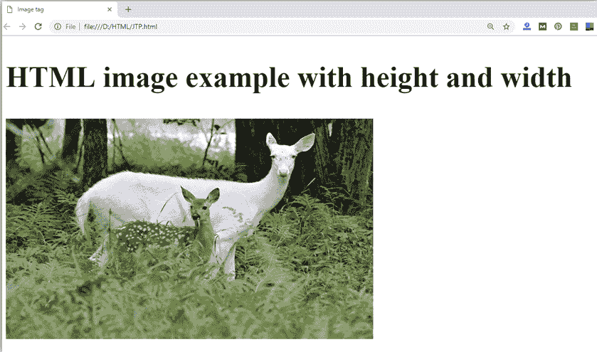
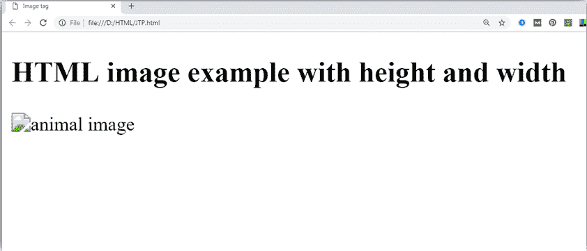

# HTML 图像

> 原文：<https://www.javatpoint.com/html-image>

**HTML img 标签**用于在网页上显示图像。HTML img 标签是一个只包含属性的空标签，在 HTML 图像元素中不使用结束标签。

让我们看一个 HTML 图像的例子。

```html
HTML 图像示例

```

[Test it Now](https://www.javatpoint.com/oprweb/test.jsp?filename=htmlimage1)

输出:


* * *

## HTML img 标签的属性

src 和 alt 是 HTML img 标签的重要属性。下面给出了 HTML 图像标签的所有属性。

#### 1) src

它是描述图像来源或路径的必要属性。它指示浏览器在服务器上的哪里查找图像。

映像的位置可能在同一目录或另一台服务器上。

#### 2)替代

如果图像无法显示，alt 属性会为图像定义替代文本。alt 属性的值用文字描述图像。alt 属性被认为有利于搜索引擎优化前景。

#### 3)宽度

这是一个可选属性，用于指定显示图像的宽度。现在不推荐。您应该应用 CSS 来代替宽度属性。

#### 4)高度

它是图像的高度。HTML 高度属性还支持 iframe、图像和对象元素。现在不推荐。你应该应用 CSS 来代替高度属性。

* * *

## img 标签使用高度和宽度属性

您已经学习了如何在网页中插入图像，现在如果我们想根据我们的要求给出一些高度和宽度来显示图像，那么我们可以用图像的高度和宽度属性来设置它。

## 示例:

```html


```

[Test it Now](https://www.javatpoint.com/oprweb/test.jsp?filename=htmlimage2)

**输出:**



#### 注意:一定要插入有高度和宽度的图片，否则在网页上显示时可能会闪烁。

* * *

## alt 属性的使用

我们可以使用带有标签的 alt 属性。如果图像无法在浏览器上显示，它将显示替代文本。以下是 alt 属性的示例:

```html
	

```

**输出:**



* * *

## 如何从另一个目录/文件夹获取图像？

要在网站中插入图像，该图像必须出现在您放置 HTML 文件的同一文件夹中。但是，如果在某些情况下图像在其他目录中可用，那么您可以这样访问图像:

```html
 

```

在上面的陈述中，我们已经把图像放在本地磁盘 E ->图像文件夹- >animal.png 中

#### 注意:如果 src 网址不正确或拼写错误，那么它不会在网页上显示您的图像，所以请尝试输入正确的网址。

* * *

## 使用标签作为链接

我们也可以将一个图像与其他页面链接，或者我们可以使用一个图像作为链接。为此，将标签放入

## 示例:

```html
<a href="https://www.javatpoint.com/what-is-robotics"></a>

```

[Test it Now](https://www.javatpoint.com/oprweb/test.jsp?filename=htmlimage3)

**输出:**


* * *

## 支持浏览器

| 元素 | 铬 |  IE |  Firefox | 歌剧 |  Safari |
|  | 是 | 是 | 是 | 是 | 是 |

* * *