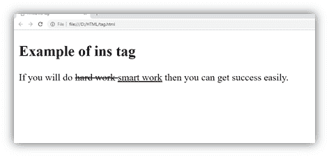

# HTML <ins>标签</ins>

> 原文：<https://www.javatpoint.com/html-ins-tag>

HTML <ins>标签用于表示 HTML 文档中新增的文本。它通常在整个文本中以下划线呈现，但可以使用 CSS 属性进行更改。</ins>

当与~~元素一起使用时，<ins>标签更有用，因为它代表已删除的文本部分，<ins>代表已插入文档的文本部分。</ins></ins>~~

### 语法:

```html

    <ins>Insert the text.......</ins>

```

**以下是关于 HTML < ins >标签**的一些规范

| **显示** | **直列** |
| **开始标签/结束标签** | 开始和结束标签 |
| 用法 | 语义学 |

### 例子

```html

<!DOCTYPE html>
<html>
<head>
	<title>HTML ins Tag</title>
</head>
<body>
<h2>Example of ins tag</h2>
<p>
	If you will do <del>hard work </del> <ins>smart work</ins> then you will get success easily 
</p>
</body>
</html>

```

[Test it Now](https://www.javatpoint.com/oprweb/test.jsp?filename=htmlinstag)

**输出:**



## 属性

### 特定于标签的属性

| 属性 | 价值 | 描述 |
| 引用 | 统一资源定位器 | 它指定了解释更改原因的资源的 URL。 |
| 日期时间 | YYYMMDD
时:分:秒 | 它指定了更改的日期和时间。 |

### 全局属性

HTML <ins>标签支持 HTML 中的全局属性</ins>

### 事件属性

HTML <ins>标签支持 HTML 中的事件属性。</ins>

## 支持浏览器

| **元素** | 铬 |  IE |  Firefox | 歌剧 |  Safari |
| **T2 ins>T1】** | 是 | 是 | 是 | 是 | 是 |