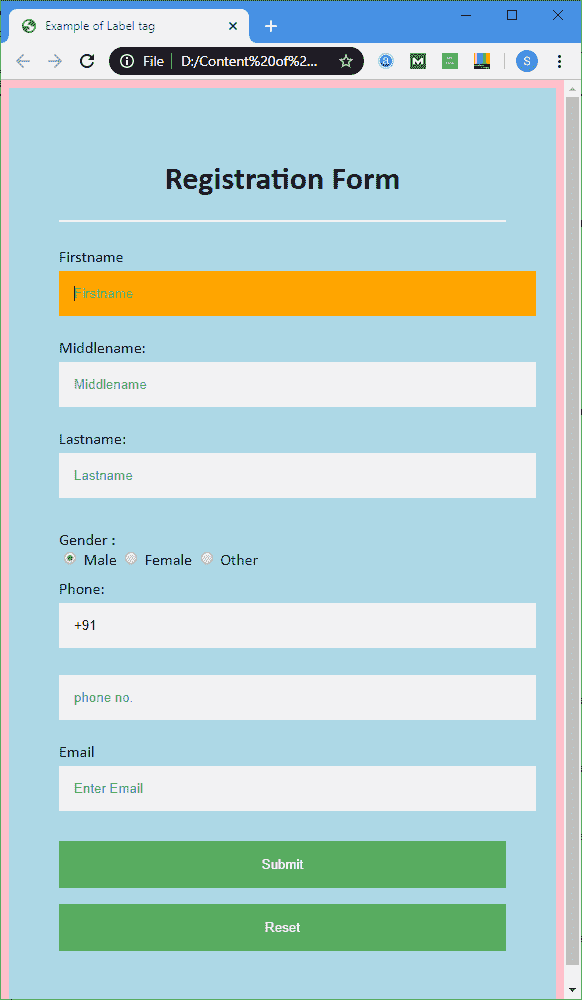
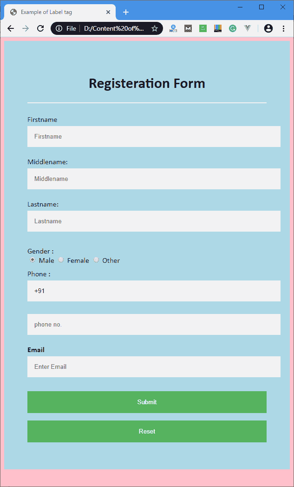

# HTML <label>标签</label>

> 原文：<https://www.javatpoint.com/html-label-tag>

**<标签>** 标签用于为表单的<输入>元素指定标签。它向表单控件添加标签，如文本、电子邮件、密码、文本区域等。当用户点击<标签>元素中的文本时，它切换控件。

### 语法:

```html
<label> form_content... </label>

```

**该标签可以通过以下两种方式使用:**

1.设置 **<输入>** 元素内的 **id 属性**，并为<标签>标签内的属性指定其名称为**。**

**示例:**本示例对表单中使用的每个标签标签使用 for 属性。

```html
<!DOCTYPE html>
<html>
<head>
<meta name="viewport" content="width=device-width, initial-scale=1">
<title>
Example of Label tag
</title>
<style>
/* The following tag selector body use the font-family and background-color properties for body of a page*/

body {
font-family: Calibri, Helvetica, sans-serif;
background-color: pink;
} 
/* Following container class used padding for generate space around it, and also use a background-color for specify the color lightblue as a background */  
.container {
padding: 50px;
background-color: lightblue;
}
/* The following tag selector input use the different properties for the text filed. */
input[type=text] {
  width: 100%;
  padding: 15px;
margin: 5px 0 22px 0;
display: inline-block;
 border: none;
 background: #f1f1f1;
}
input[type=text]:focus {
background-color: orange;
outline: none;
}
 div {
            padding: 10px 0;
}    
hr {
  border: 1px solid #f1f1f1;
  margin-bottom: 25px;
}
/* The following tag selector button uses the different properties for the Button. */
button {
  background-color: #4CAF50;
  color: white;
  margin: 8px 0;
  border: none;
  cursor: pointer;
  padding: 16px 20px;
  width: 100%;
  opacity: 0.9;
}
/* The following tag selector hover uses the opacity property for the Button which select button when you mouse over it. */
button:hover {
opacity: 1;
}
</style>
</head>
<body>
<form>
<div class="container">
<center>  <h1> Registration Form</h1> </center>
<hr>
<label for="firstname"> 
Firstname 
</label> 
<input type="text" id="firstname" name="ftname" placeholder= "Firstname" size="15" required /> 
<label for="middlename"> 
Middlename: 
</label> 
<input type="text" id="middlename" name="mname" placeholder="Middlename" size="15" required /> 
<label for="lastname"> 
Lastname: 
</label>  
<input type="text" id="lastname" name="ltname" placeholder="Lastname" size="15"required /> 
<div>
<label for="gender"> 
Gender :
</label>
<br>
<input type="radio" id="gender" value="Male" name="gender" checked > Male 
<input type="radio" id="gender" value="Female" name="gender"> Female 
<input type="radio" id="gender" value="Other" name="gender"> Other

</div>
<label for="Phone"> 
Phone:
</label>
<input type="text" name="country code" placeholder="Country Code"  value="+91" size="2"/> 
<input type="text" id="Phone" name="phone" placeholder="phone no." size="10"/ required> 
<label for="email"> 
Email
</label>
<input type="text" id="email" placeholder="Enter Email" name="email" required>
<button type="submit" value="submit">Submit</button>
<button type="reset" value="submit">Reset</button>
</form>
</body>
</html>

```

[Test it Now](https://www.javatpoint.com/oprweb/test.jsp?filename=htmllabeltag1)

**输出:**



2.我们也可以在表单的<label>元素中使用<input>标签。</label>

**示例:**本示例使用 **<在表单中的**</标签>** 元素内输入>** 标签。

```html
<!DOCTYPE html>
<html>
<head>
<meta name="viewport" content="width=device-width, initial-scale=1">
<style>
/* The following tag selector body use the font-family and background-color properties for body of a page*/
body{
font-family: Calibri, Helvetica, sans-serif;
background-color: pink;
}
/* Following container class used padding for generate space around it, and also use a background-color for specify the color lightblue as a background */  
.container {
padding: 50px;
background-color: lightblue;
}
/* The following tag selector input use the different properties for the text filed. */
input[type=text] {
  width: 100%;
  padding: 15px;
margin: 5px 0 22px 0;
display: inline-block;
 border: none;
 background: #f1f1f1;
}
input[type=text]:focus {
background-color: orange;
outline: none;
}
 div {
            padding: 10px 0;

        }

hr {
  border: 1px solid #f1f1f1;
  margin-bottom: 25px;
}
/* The following tag selector button use the different properties for the Button. */
button {
  background-color: #4CAF50;
  color: white;
  padding: 16px 20px;
 border: none;
  cursor: pointer;
 margin: 8px 0;
  width: 100%;
  opacity: 0.9;
}

button:hover {
opacity: 1;
}

</style>
</head>
<body>
<form>
<div class="container">
<center>  <h1> Registration Form </h1> </center>

<hr>
<label> Firstname 
<input type="text" name="firstname" placeholder= "Firstname" size="15" required /> 
</label> 
<label> Middlename: 
<input type="text" name="middlename" placeholder="Middlename" size="15" required /> 
</label> 
<label> Lastname:  
<input type="text" name="lastname" placeholder="Lastname" size="15"required /> 
</label> 
<div>
<label> 
Gender :
<br>
<input type="radio" value="Male" name="gender" checked > Male 
<input type="radio" value="Female" name="gender"> Female 
<input type="radio" value="Other" name="gender"> Other
</label>

</div>
<label> 
Phone :
<input type="text" name="country code" placeholder="Country Code"  value="+91" size="2"/> 
<input type="text" name="phone" placeholder="phone no." size="10"/ required> 
</label>

<label>
<b>
Email :
</b>
<input type="text" placeholder="Enter Email" name="email" required>
</label>
<button type="submit" value="submit">Submit</button>
<button type="reset" value="submit">Reset</button>
</form>
</body>
</html>

```

[Test it Now](https://www.javatpoint.com/oprweb/test.jsp?filename=htmllabeltag2)

**输出:**这个例子的输出也和第一个一样，但是它们的区别在于实现。



## 属性

下表描述了 **<标签>** 标签的所有属性:

**属性描述**

对于，它定义了标签正在描述的**形状元素**。

**表单**它定义了标签所属的**表单**。

## 支持浏览器

| 元素 | 铬 |  IE |  Firefox | 歌剧 |  Safari |
| **<标签>** | 是 | 是 | 是 | 是 | 是 |

* * *