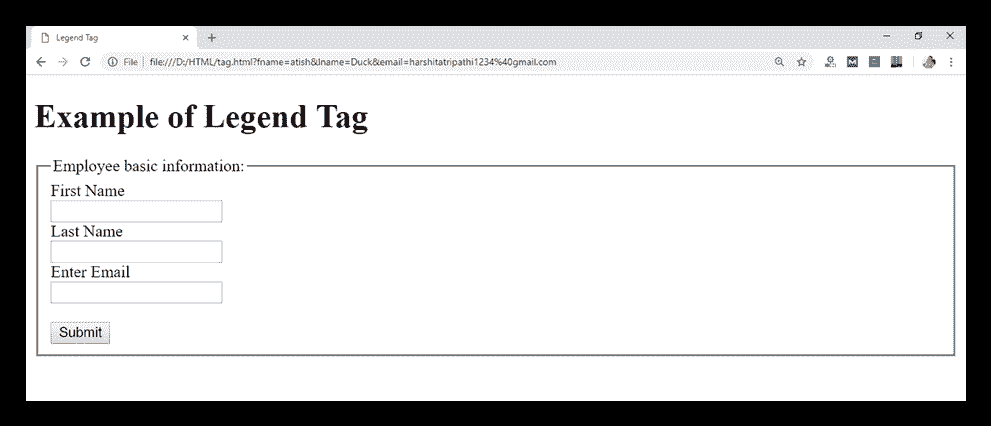

# HTML <legend>标签</legend>

> 原文：<https://www.javatpoint.com/html-legend-tag>

HTML <legend>标签用于向其父元素插入标题或说明，如</legend>

<fieldset>。<legend>元素必须是</legend>

<fieldset>元素的第一个子元素。</fieldset>

</fieldset>

通过使用带有

<form>元素的<legend>标签，很容易理解分组表单元素的目的。</legend></form>

### 句法

```html

<legend> Content........<legend>

```

**以下是关于 HTML <图例>标签**的一些说明

| **显示** | **区块** |
| **开始标签/结束标签** | 开始和结束标签 |
| 用法 | 本文的 |

### 例子

```html

<!DOCTYPE html>
<html>
<head>
<title>Legend Tag</title>
</head>
<body>
 <h1>Example of Legend Tag</h1>	
 <form>
              <fieldset>
		<legend>Employee basic information:</legend>
		<label>First Name</label><br>
		<input type="text" name="fname"><br>
		<label>Last Name</label><br>
		<input type="text" name="lname"><br>
		<label>Enter Email</label><br>
		<input type="email" name="email"><br><br>
		<input type="Submit"><br>
                </fieldset>
</form>
</body>
</html>

```

[Test it Now](https://www.javatpoint.com/oprweb/test.jsp?filename=htmllegendtag)

**输出:**



## 属性:

### 特定于标签的属性:

| 属性 | 价值 | 描述 |
| 排列 | 

*   top
*   bottom
*   the left side
*   right

 | 它指定标题的对齐方式。
(html 5 不支持) |

### 全局属性:

<legend>标签支持 HTML 中的全局属性</legend>

### 事件属性:

<legend>标签支持 HTML 中的事件属性。</legend>

## 支持浏览器

| **元素** | 铬 |  IE |  Firefox | 歌剧 |  Safari |
| **<传说>** | 是 | 是 | 是 | 是 | 是 |