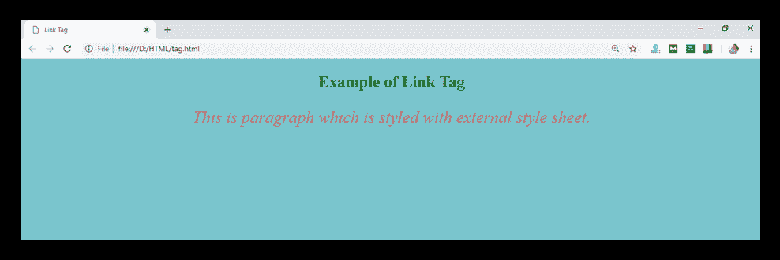

# HTML <link>标签

> 原文:[https://www.javatpoint.com/html-link-tag](https://www.javatpoint.com/html-link-tag)

HTML <link>标签用于指定当前文档与外部来源的关系。

<link>标记通常用于链接当前文档的外部样式表，但也可以与链接站点图标一起使用。它被放在文件的头部。

### 例子

```

<link rel="stylesheet" type="text/css" href="">

```

**以下是关于 HTML <链接>标签**的一些规范

| **显示** | **无** |
| **开始标签/结束标签** | 开始和结束标签 |
| 用法 | 本文的 |

### 例子

```

<!DOCTYPE html>
<html>
<head>
	<title>Link Tag</title>
	<link rel="stylesheet" type="text/css" href="htmlpages/css/link.css">
</head>
<body>
	<h2>Example of Link Tag</h2>
	<p>This is paragraph which is styled with external style sheet. </p>
</body>
</html>

```

[Test it Now](https://www.javatpoint.com/oprweb/test.jsp?filename=htmllinktag)```

body{
	background-color: #7ac5cd;
		text-align: center;}
h2{
	color: #006400;}

p{
	color: #cd5c5c;
	font-size: 25px;
	font-style: italic;}

```

**输出:**



## 属性:

### 特定于标签的属性:

| 属性 | 价值 | 描述 |
| 字符集 | 字符编码 | 它定义了链接源的字符编码。(HTML5 中不支持) |
| 超链接 | 统一资源定位器 | 它指定链接文档的位置。 |
| 元首万岁 | 语言代码 | 指定链接源的文本语言。 |
| 媒体 | 媒体查询 | 它指定应用链接源的介质。 |
| 能量损耗率 | 

*   be a candidate (for a vacancy)
*   author
*   DNS- prefetch
*   help
*   icon
*   permit
*   next
*   Pinghui
*   Preconnection
*   Prefetch
*   prestrain
*   Preposition device
*   上一个
*   search
*   style sheet

 | 它描述了当前文档和链接文档之间的关系。(必需) |
| 发动机的旋转 | 颠倒
关系 | 它描述链接文档和当前文档之间的关系。(HTML5 中不支持) |
| 大小 | 身高*体重 | 它指定链接源的大小。它只能与 rel="icon "一起使用。 |
| 目标 | _ blank
_ self
_ top
_ parent
frame _ name | 它决定加载链接文档的位置。 |
| 类型 | 媒体类型 | 它指定文档的媒体类型。 |

### 全局属性:

<link>标签支持 HTML 中的全局属性

### 事件属性:

<link>标签支持 HTML 中的事件属性。

## 支持浏览器

| **元素** | 铬 |  IE |  Firefox | 歌剧 |  Safari |
| **<链接>** | 是 | 是 | 是 | 是 | 是 |**