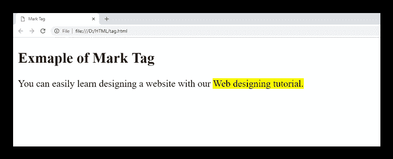

# HTML <mark>标签</mark>

> 原文:[https://www.javatpoint.com/html-mark-tag](https://www.javatpoint.com/html-mark-tag)

HTML <mark>标签用于突出显示另一个元素(如段落)内部的一些文本部分，以供参考或任何符号目的。</mark>

这是一个新添加的标签，并在 HTML5 中引入。

在大多数浏览器中，包含<mark>标签的文本呈现黄色背景，但是可以使用 CSS 背景色属性进行更改。</mark>

### 语法:

```

  <mark>write your content here....</mark>

```

**以下是关于 HTML <标记>标签**的一些规范

| **显示** | **直列** |
| **开始标签/结束标签** | 开始和结束标签 |
| 用法 | 语义和文本 |

### 例子

```

<!DOCTYPE html>
<html>
<head>
	<title>Mark Tag</title>
</head>
<body>
 <h2>Exmaple of Mark Tag</h2>
 <p>You can easily learn designing a website with our <mark>Web designing tutorial. </mark></p>
</html>

```

[Test it Now](https://www.javatpoint.com/oprweb/test.jsp?filename=htmlmarktag)

**输出:**



## 属性:

### 全局属性:

<mark>标签支持 HTML 中的全局属性</mark>

### 事件属性:

<mark>标签支持 HTML 中的事件属性。</mark>

## 支持浏览器

| **元素** | 铬 |  IE |  Firefox | 歌剧 |  Safari |
| **<标记>** | 是 | 是 | 是 | 是 | 是 |