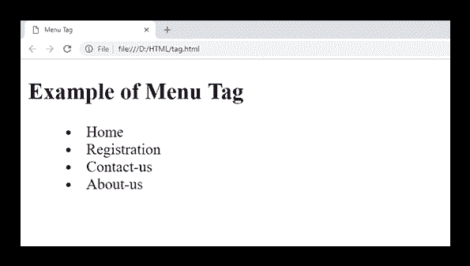

# HTML

<menu>标签</menu>

> 原文:[https://www.javatpoint.com/html-menu-tag](https://www.javatpoint.com/html-menu-tag)

HTML

<menu>标签指定了用户可以执行或激活的命令列表或菜单。它用于创建上下文菜单和列表菜单。</menu>

一个

<menu>元素可以包含一个或多个*   Or  element.</menu>

#### 注意:

<menu>标记在 HTML 4.01 中被弃用，并再次包含在 HTML 5.1 规范中。但是最好忽略它，因为它是实验性的，不被许多浏览器支持。</menu>

### 句法

```

  <menu>........<menu>

```

**以下是关于 HTML <菜单>标签**的一些说明

| **显示** | **直列** |
| **开始标签/结束标签** | 开始和结束标签 |
| 用法 | 语义和文本 |

### 例子

```

  <!DOCTYPE html>
  <html>
 <head>
  <title>Menu Tag</title>
  </head>
  <body>
  <h2>Example of Menu Tag</h2>
 <menu>
 	<li>Home</li>
 	<li>Registration</li>
 	<li>Contact-us</li>
 	<li>About-us</li>
 </menu>
</body>
</html>

```

[Test it Now](https://www.javatpoint.com/oprweb/test.jsp?filename=htmlmenutag)

**输出:**



## 属性:

### 特定于标签的属性:

*   弹出
*   工具栏
*   语境

| 属性 | 价值 | 描述 |
| 标签〔t0〕 | 文本 | 它指定菜单的标签。 |
| 类型 | 它指定了 HTML 文档中菜单的类型。 |

### 全局属性:

<menu>标签支持 HTML 中的全局属性</menu>

### 事件属性:

<menu>标签支持 HTML 中的事件属性。</menu>

## 支持浏览器

| **元素** | 铬 |  IE |  Firefox | 歌剧 |  Safari |
| **<菜单>** | 不 | 不 | 是 | 不 | 不 |