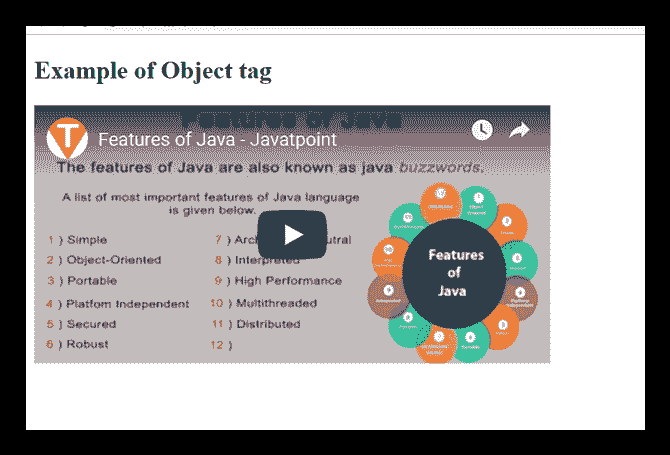
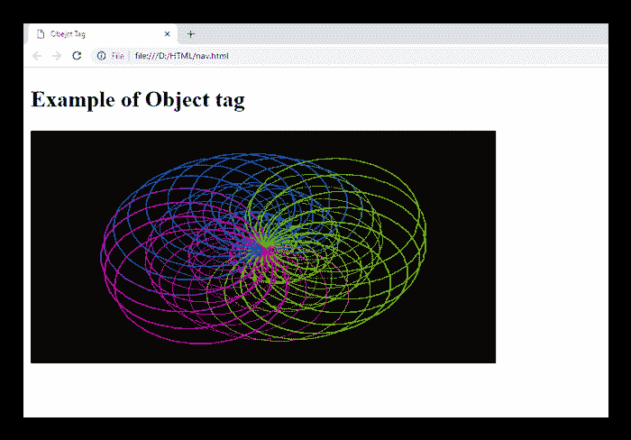

# HTML <object>标签</object>

> 原文：<https://www.javatpoint.com/html-object-tag>

HTML <object>标签用于在网页上嵌入多媒体文件。<object>标签可以包括多媒体文件，如视频、音频、图像、PDF、Java 小程序或页面上的其他页面。</object></object>

HTML <param>标签也与<object>标签一起使用，将参数传递给已经包含在<object>标签中的插件。</object></object>

如果在<object>和</object>标签之间插入文本，那么只有当浏览器不支持<object>标签时才会显示。</object>

### 句法

```html

     <object data="" type=""></object>

```

**以下是关于 HTML <对象>标签**的一些规范

| **显示** | **直列** |
| **开始标签/结束标签** | 开始和结束标签 |
| 用法 | 嵌入外部资源 |

### 例子

**嵌入视频:**

```html

<!DOCTYPE html>
<html>
<head>
<title>Obejct Tag</title>
</head>
<body>
 <h2>Example of Object tag</h2>
 <object height="250" width="500" data="https://www.youtube.com/embed/O5hShUO6wxs"></object>
</body>
</html>

```

[Test it Now](https://www.javatpoint.com/oprweb/test.jsp?filename=htmlobjecttag)

**输出:**



**嵌入 gif 图像:**

```html

<!DOCTYPE html>
<html>
<head>
<title>Obejct Tag</title>
</head>
<body>
 <h2>Example of Object tag</h2>
 <object height="250" width="500" data="circle.gif">Sorry!,Your browser does not support</object>
</body>
</html>

```

[Test it Now](https://www.javatpoint.com/oprweb/test.jsp?filename=htmlobjecttag2)

**输出:**



## 属性:

### 特定于标签的属性:

| 属性 | 价值 | 描述 |
| 数据 | 统一资源定位器 | 它指定资源的地址。 |
| 类型 | 内容类型 | 它确定由数据指定的资源的内容类型。 |
| 档案馆 | 统一资源定位器 | 它为对象的资源档案指定以空格分隔的 URL 列表。**(html 5 不支持)**。 |
| 边界 | 像素 | 设置<object>**(html 5 不支持)**周围边框的宽度。</object> |
| 分类码 | 统一资源定位器 | 它指定对象实现的网址。**(html 5 不支持)**。 |
| 代码库 | 统一资源定位器 | 它指定查找对象代码的基本路径。**(html 5 不支持)**。 |
| 形式 | 表单 _ idIt | 指定与对象元素关联的表单元素。 |
| 高度 | 像素 | 它定义了对象的高度。 |
| 宽度 | 像素 | 它决定了对象的宽度。 |
| typemustmatch | 布尔 | 它指定如果类型属性与数据属性上提供的资源的实际内容类型匹配，则应该嵌入资源。 |
| 名字 | 名字 | 它定义了对象的名称。 |

### 全局属性:

<**对象** >标签支持 HTML 中的全局属性

### 事件属性:

<**对象** >标签支持 HTML 中的事件属性。

## 支持浏览器

| **元素** | 铬 |  IE |  Firefox | 歌剧 |  Safari |
| **<物体>** | 是 | 是 | 是 | 是 | 是 |