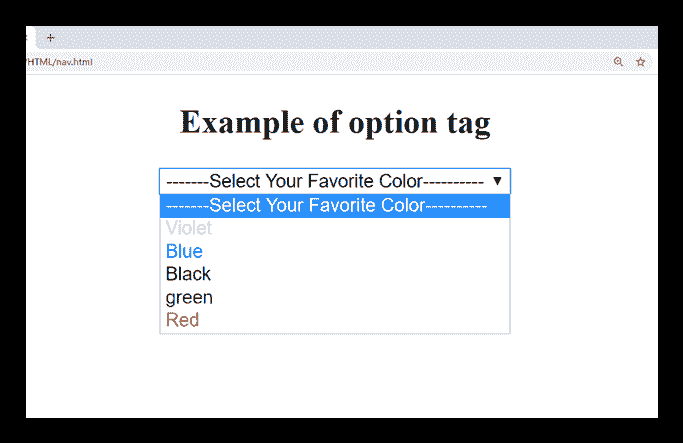

# HTML <option>标签</option>

> 原文：<https://www.javatpoint.com/html-option-tag>

HTML <option>标签用于在<select>或元素的下拉列表中定义选项。下拉列表必须至少有一个<option>元素。</option></select></option>

下拉列表的相关<option>可以使用</option><optgroup>元素进行分组，这有助于理解大列表。</optgroup>

#### 提示:<option>标记可以不带任何属性使用，但应该与值属性一起使用，该值属性指定发送给服务器的内容。

### 语法

```html

   <option value="">.....</option>

```</option> 

**以下是关于 HTML <选项>标签**的一些规范

| **显示** | **直列** |
| **开始标签/结束标签** | 开始和结束标签 |
| 用法 | 表格和输入 |

### 例子

```html

<!DOCTYPE html>
<html>
<head>
	<title>Option Tag</title>
	<style>
		body{
			text-align: center;}
	 </style>
</head>
<body>
 <h2>Example of option tag</h2>
 <form>
 	<select>
 		<option>-------Select Your Favorite Color----------</option>
 		<option value="yellow" style="color: violet;">Violet</option>
 		<option value="white" style="color: blue;">Blue</option>
 		<option value="black" style="color: black;">Black</option>
 		<option value="green" style="color: green;">green</option>
 		<option value="red" style="color: red;">Red</option>
 	</select>
 </form>
</body>

```

[Test it Now](https://www.javatpoint.com/oprweb/test.jsp?filename=htmloptiontag)

**输出:**



## 属性:

### 特定于标签的属性:

| 属性 | 价值 | 描述 |
| 有缺陷的 | 有缺陷的 | 如果已设置，则该选项将被禁用。 |
| 标签 | 文本 | 它定义了列表项的名称。 |
| 挑选 | 挑选 | 如果设置了它，那么它将在列表中被默认选择。 |
| 价值 | 文本 | 它指定发送到服务器的数据。 |

### 全局属性:

HTML <option>标签支持 HTML 中的全局属性</option>

### 事件属性:

HTML <option>标签支持 HTML 中的事件属性。</option>

## 支持浏览器

| **元素** | 铬 |  IE |  Firefox | 歌剧 |  Safari |
| **<选项>** | 是 | 是 | 是 | 是 | 是 |