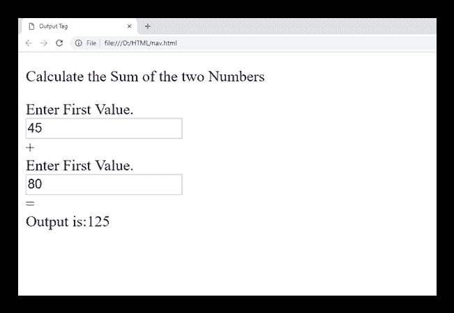

# HTML

<output>标签</output>

> 原文：<https://www.javatpoint.com/html-output-tag>

HTML

<output>标签用于显示某些计算的结果(由 JavaScript 执行)或用户动作的结果(例如将数据输入表单元素)。</output>

<output>标签是一个新添加的标签，在 HTML5 中引入。</output>

### 句法

```html

<output>......</output>

```

**以下是关于 HTML <输出>标签**的一些规范

| **显示** | **直列** |
| **开始标签/结束标签** | 开始和结束标签 |
| 用法 | 表格和输入 |

### 例子

```html

<!DOCTYPE html>
<html>
<head>
<title>Output Tag</title>
</head>
<body>
 <p>Calculate the Sum of the two Numbers</p>
 <form oninput="res.value=parseInt(a.value)+parseInt(b.value);">
 	<label>Enter First Value.</label><br>
 	<input type="number" name="a" value=""/><br>
 	+<br/>
 	<label>Enter First Value.</label><br> 
 	<input type="number" name="b" value=""><br>
 	=<br>
 	Output is:<output name="res"></output>
 </form>
</body>
</html>

```

[Test it Now](https://www.javatpoint.com/oprweb/test.jsp?filename=htmloutputtag)

**输出:**



## 属性:

### 特定于标签的属性:

| 属性 | 价值 | 描述 |
| 为 | 元素 id | 它指定其他元素的 id 列表，该列表指示计算结果和输入元素之间的关系。 |
| 形式 | 表单 id | 它指定与此元素关联的表单元素。 |
| 名字 | 名字 | 它定义了输出元素的名称。 |

### 全局属性:

HTML

<output>标签支持 HTML 中的全局属性。</output>

### 事件属性:

HTML

<output>标签支持 HTML 中的事件属性。</output>

## 支持浏览器

| **元素** | 铬 |  IE |  Firefox | 歌剧 |  Safari |
| **<输出>** | 是 | 是 | 是 | 是 | 是 |