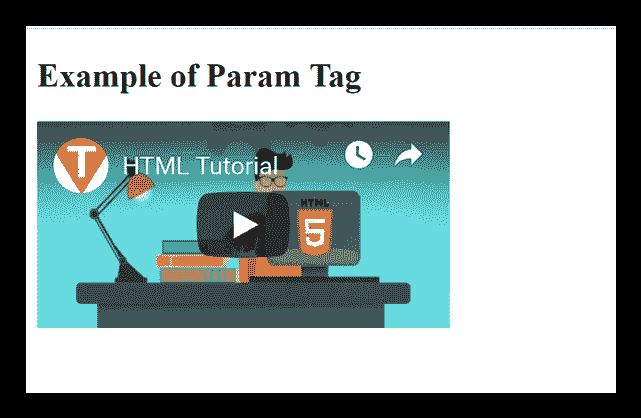

# HTML <param>标签

> 哎哎哎:# t0]https://www . javatppoint . com/html-param 标记

HTML <param>标签用于将参数传递给已经使用<object>元素嵌入的对象。</object>

我们可以在一个<object>元素中以任何顺序使用多个<param>标签，但是每个标签必须包含名称和值属性，并且应该放在内容的开头。</object>

<param>标签使用一对不同的值属性名称来控制<object>元素的行为，例如自动播放、控制器等。</object>

### 句法

```

   <param name=" " value="">

```

**以下是关于 HTML <参数>标签**的一些规范

| **显示** | **直列** |
| **开始标签/结束标签** | 空标签(禁止结束标签) |
| 用法 | 设计 |

### 例子

```

  <!DOCTYPE html>
<html>
<head>
<title>Param Tag</title>
</head>
<body>
<h2>Example of Param Tag</h2>
<object data="https://www.youtube.com/embed/JHq3pL4cdy4" >
<param name="controller" value="true">
</object>
</body>
</html>

```

[Test it Now](https://www.javatpoint.com/oprweb/test.jsp?filename=htmlparamtag)

**输出:**



## 属性:

### 特定于标签的属性:

| 属性 | 价值 | 描述 |
| 名字 | 文本 | 它确定参数的名称。 |
| 价值 | 文本 | 它决定了参数的值。 |
| 类型 | 内容类型 | 它指定参数的媒体类型，并且仅在 valuetype 设置为“ref”时使用。(HTML5 中不支持) |
| 值类型 | 

*   data
*   refer to
*   target

 | 它决定了值属性的类型。(HTML5 中不支持) |

### 全局属性:

HTML <param>标签支持 HTML 中的全局属性。

### 事件属性:

HTML <param>标签支持 HTML 中的事件属性。

## 支持浏览器

| **元素** | 铬 |  IE |  Firefox | 歌剧 |  Safari |
| **<停止>** | 是 | 是 | 是 | 是 | 是 |