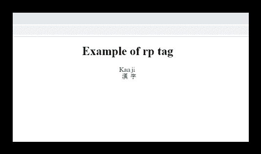

# HTML <rp>标签</rp>

> 原文:[https://www.javatpoint.com/html-rp-tag](https://www.javatpoint.com/html-rp-tag)

如果浏览器不支持显示 ruby 注释，HTML <rp>标签用于为浏览器中要显示的内容提供后括号。</rp>

ruby 注释用于显示几种亚洲语言中的某些字符，使用<ruby>元素。</ruby>

<rp>标记必须用包含注释文本的括号将<rt>元素括起来。</rt></rp>

<rp>标签在 HTML5 中是新的。</rp>

### 句法

```

  <rp>.....</rp>

```

**以下是关于 HTML < rp >标签**的一些规范

| **显示** | **直列** |
| **开始标签/结束标签** | 开始和结束标签 |
| 用法 | 本文的 |

### 例子

```

<!DOCTYPE html>
<html>
<head>
	<title>HTML rp tag</title>
	<style>
	body{
		text-align: center;
	}
		rt{ font-size: 18px;
			color: green;
		}
	</style>
</head>
<body>
<h1>Example of rp tag</h1>
<ruby>
	 漢<rp>(</rp><rt>Kan</rt><rp>)</rp>
	字 <rp>(</rp><rt>ji</rt><rp>)</rp>
</ruby>
</body>
</html>

```

[Test it Now](https://www.javatpoint.com/oprweb/test.jsp?filename=htmlrptag)

**输出:**



## 属性:

### 特定于标签的属性:

<rp>标签不包含任何特定属性。</rp>

### 全局属性:

<rp>标签支持 HTML 中的全局属性</rp>

### 事件属性:

<rp>标签支持 HTML 中的事件属性。</rp>

## 支持浏览器

| **元素** | 铬 |  IE |  Firefox | 歌剧 |  Safari |
| **<【RP】>** | 是 | 是 | 是 | 是 | 是 |