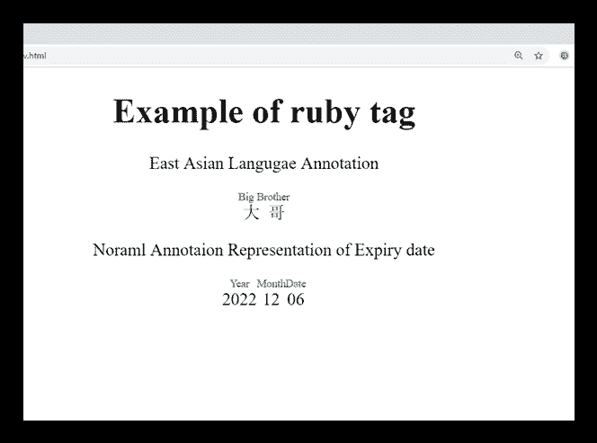

# HTML <ruby>标签</ruby>

> 原文:[https://www.javatpoint.com/html-ruby-tag](https://www.javatpoint.com/html-ruby-tag)

HTML <ruby>标签用于表示网页上的 ruby 注释。如果我们想显示东亚字符的发音，比如中文和日文中文，Ruby 注释非常有用。</ruby>

<ruby>标签包含一个或多个<rt>元素，给出红宝石注释的发音，并显示在注释字符上方。它还可以包含</rt><rp>(可选)元素，该元素用作不支持 ruby 注释的浏览器的后括号。</rp></ruby>

除了东亚语言之外，HTML <ruby>标签也可以用来表示与主要内容相关的小标注。</ruby>

<ruby>标签在 HTML5 中是新的。</ruby>

### 句法

```

   <ruby>......</ruby>

```

**以下是关于 HTML < ruby >标签**的一些规范

| **显示** | **直列** |
| **开始标签/结束标签** | 开始和结束标签 |
| 用法 | 格式化 |

### 例子

```

<!DOCTYPE html>
<html>
<head>
	<title>HTML ruby tag</title>
	<style>
	body{
		text-align: center;
	}
		rt{ font-size: 10px;
			color: green;
		}
	</style>
</head>
<body>
<h1>Example of ruby tag</h1>
<p>East Asian Langugae Annotation</p>
<ruby>
	 大哥<rt>Big Brother</rt>
</ruby>

<p>Noraml Annotaion Representation of Expiry date</p>
<ruby>
	2022<rp>(</rp><rt>Year</rt><rp>)</rp>
	 12<rp>(</rp><rt> Month</rt><rp>)</rp>
	06<rp>(</rp><rt>Date</rt><rp>)</rp>
</ruby>
</body>
</html>

```

[Test it Now](https://www.javatpoint.com/oprweb/test.jsp?filename=htmlrubytag)

**输出:**



## 属性:

### 特定于标签的属性:

<ruby>标签不包含任何特定属性。</ruby>

### 全局属性:

<ruby>标签支持 HTML 中的全局属性</ruby>

### 事件属性:

<ruby>标签支持 HTML 中的事件属性。</ruby>

## 支持浏览器

| **元素** | 铬 |  IE |  Firefox | 歌剧 |  Safari |
| **<红宝石>** | 是 | 是 | 是 | 是 | 是 |