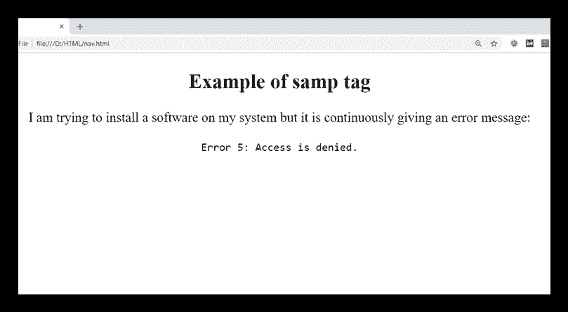

# HTML <samp>标签</samp>

> 原文:[https://www.javatpoint.com/html-samp-tag](https://www.javatpoint.com/html-samp-tag)

HTML <samp>标签是一个短语标签，用于表示浏览器中计算机程序或脚本的样本输出。</samp>

写在<samp>和</samp>之间的内容，标签在浏览器中呈现？的默认等间距字体。

#### 注意:<samp>标记还没有被弃用，但是也可以使用 CSS 属性达到同样的效果。</samp>

### 句法

```

<samp>Write sample output here.....</samp>

```

**以下是关于 HTML <样本>标签**的一些规范

| **显示** | **直列** |
| **开始标签/结束标签** | 开始和结束标签 |
| 用法 | 本文的 |

### 例子

```

<!DOCTYPE html>
<html>
<head>
	<title>HTML samp tag</title>
	<style>
     body{
     	text-align: center;
              }
    </style>
</head>
<body> 
<h2>Example of samp tag</h2>
<p>I am trying to install a software on my system but it is continuously giving an error message:
</p>
<p><samp>Error 5: Access is denied.</samp></p>
</body>
</html>

```

[Test it Now](https://www.javatpoint.com/oprweb/test.jsp?filename=htmlsamptag)

**输出:**



## 属性:

### 特定于标签的属性:

<samp>标签不包含任何特定属性。</samp>

### 全局属性:

<samp>标签支持 HTML 中的全局属性</samp>

### 事件属性:

<samp>标签支持 HTML 中的事件属性。</samp>

## 支持浏览器

| **元素** | 铬 |  IE |  Firefox | 歌剧 |  Safari |
| **<桑普>** | 是 | 是 | 是 | 是 | 是 |