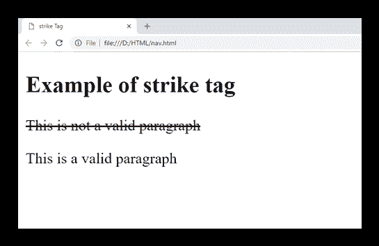

# HTML ~~标签(HTML5 不支持)~~

> 原文：<https://www.javatpoint.com/html-strike-tag>

HTML ~~标签用于在文本中划一条线，包含在文本中。~~

#### 注意:不要使用~~标签，因为它现在已经过时了，HTML5 也不支持，可以使用~~、~~或者 CSS 来达到同样的效果。~~~~~~

### 句法

```html

   <strike>Your content here....</strike>

```

**以下是关于 HTML <打击>标签**的一些规范

| **显示** | **直列** |
| **开始标签/结束标签** | 开始和结束标签 |
| 用法 | 格式化 |

### 例子

```html

<!DOCTYPE html>
<html>
<head>
	<title>strike Tag</title>
</head>
<body>
 <h2>Example of strike tag</h2>
 <p><strike>This is not a valid paragraph</strike></p>
  <p>This is a valid paragraph</p>
</body>
</html>

```

[Test it Now](https://www.javatpoint.com/oprweb/test.jsp?filename=htmlstriketag)

**输出:**



## 属性:

### 特定于标签的属性:

~~标签不包含任何特定属性。~~

## 支持浏览器

| **元素** | 铬 |  IE |  Firefox | 歌剧 |  Safari |
| **<击>** | 是 | 是 | 是 | 是 | 是 |