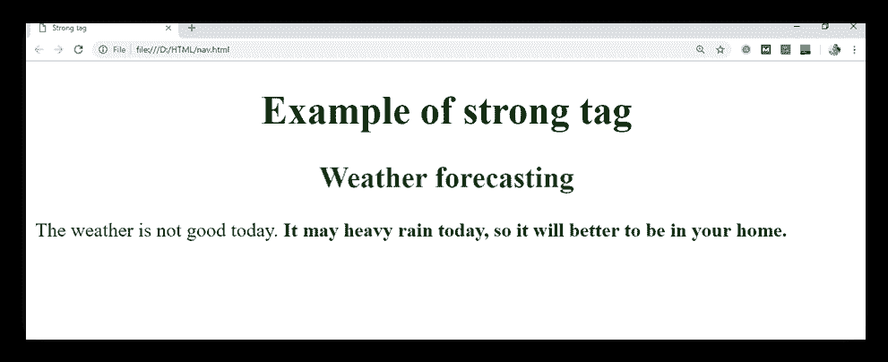

# HTML **标签**

> 原文:[https://www.javatpoint.com/html-strong-tag](https://www.javatpoint.com/html-strong-tag)

HTML **标签是一个短语标签，用于在浏览器上表示文档的重要文本。**文本中的文本对搜索引擎具有语义重要性，并以特殊的语调强调文本。****

**标签内的文本默认在浏览器上以粗体呈现；但是，它可以使用 CSS 进行更改。**

#### 注意:不要仅仅为了让文本加粗而使用**标签，如果你想让你的文本加粗而没有任何语义重要性，那么就使用**或者 CSS 属性。****

### 句法

```

     <strong>Write your important content....</strong>

```

**以下是关于 HTML <强>标签**的一些规范

| **显示** | **直列** |
| **开始标签/结束标签** | 开始和结束标签 |
| 用法 | 格式化 |

### 例子

```

<!DOCTYPE html>
<html>
<head>
<title>Strong tag</title>
<style>
            h1,h2{
	text-align: center;
                }
           h2{
          	color: green;
            }
 </style>
 </head>
 <body>
 <h1>Example of strong tag</h1>
  <h2>Weather forecasting</h2>
   <p>The weather is not good today.
    <strong>It may heavy rain today, so it will better to be in your home.</strong>
  </p>
 </body>
</html>

```

[Test it Now](https://www.javatpoint.com/oprweb/test.jsp?filename=htmlstrongtag)

**输出:**



## 属性:

### 特定于标签的属性:

**标签不包含任何特定属性。**

### 全局属性:

**标签支持 HTML 中的全局属性。**

### 事件属性:

**标签支持 HTML 中的事件属性。**

## 支持浏览器

| **元素** | 铬 |  IE |  Firefox | 歌剧 |  Safari |
| **<强>** | 是 | 是 | 是 | 是 | 是 |