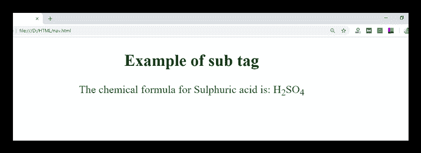

# HTML <sub>标签</sub>

> 原文:[https://www.javatpoint.com/html-sub-tag](https://www.javatpoint.com/html-sub-tag)

HTML <sub>标签被称为下标标签，用于定义下标文本。<sub>内的文本以比周围文本字体更低的基线和更小的字体呈现。</sub></sub>

<sub>标签对于表示数学公式和化学公式很有用，例如 H <sub>2</sub> O</sub>

### 句法

```

    <sub>.........</sub>

```

**以下是关于 HTML <子>标签**的一些规范

| **显示** | **直列** |
| **开始标签/结束标签** | 开始和结束标签 |
| 用法 | 本文的 |

### 例子

```

<!DOCTYPE html>
<html>
<head>
	 <title>Sub Tag</title>
	<style>
	 body{
	     text-align: center;
	 }
	 p{
	  color: green;
	 }
	</style>
</head>
<body>
<h2>Example of sub tag</h2>
<p>The chemical formula for Sulphuric acid is: H<sub>2</sub>SO<sub>4</sub></p>
</body>
</html>

```

[Test it Now](https://www.javatpoint.com/oprweb/test.jsp?filename=htmlsubtag)

**输出:**



## 属性:

### 特定于标签的属性:

<sub>标签不包含任何特定属性。</sub>

### 全局属性:

<sub>标签支持 HTML 中的全局属性。</sub>

### 事件属性:

<sub>标签支持 HTML 中的事件属性。</sub>

## 支持浏览器

| **元素** | 铬 |  IE |  Firefox | 歌剧 |  Safari |
| **<子>** | 是 | 是 | 是 | 是 | 是 |