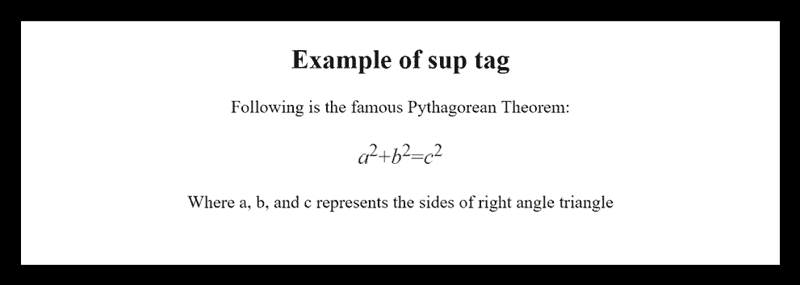

# HTML <sup>标签</sup>

> 原文:[https://www.javatpoint.com/html-sup-tag](https://www.javatpoint.com/html-sup-tag)

HTML <sup>标签被称为上标标签，用于定义上标文本。<sup>标签中的文本以较高的基线出现，并以比周围文本更小的字体呈现。</sup></sup>

<sup>标记对于定义数学公式和脚注很有用。</sup>

### 句法

```

     <sup>......</sup>

```

**以下是关于 HTML < sup >标签**的一些规范

| **显示** | **直列** |
| **开始标签/结束标签** | 开始和结束标签 |
| 用法 | 本文的 |

### 例子

```

<!DOCTYPE html>
<html>
<head>
	<title>HTML sup Tag</title>
	<style>
	   body{
		text-align: center;
		}
	</style>
</head>
<body>
 <h2>Example of sup tag</h2>
  Following is the famous Pythagorean Theorem: 
  <p style="font-size: 20px; color: green;"><var>a</var><sup>2</sup>+<var>b</var><sup>2</sup>=<var>c</var><sup>2</sup>
  </p>
  <p>Where a, b, and c represents the sides of right angle triangle</p>
</body>
</html>

```

[Test it Now](https://www.javatpoint.com/oprweb/test.jsp?filename=htmlsuptag)

**输出:**



## 属性:

### 特定于标签的属性:

<sup>标签不包含任何特定属性。</sup>

### 全局属性:

<sup>标签支持 HTML 中的全局属性。</sup>

### 事件属性:

<sup>标签支持 HTML 中的事件属性。</sup>

## 支持浏览器

| **元素** | 铬 |  IE |  Firefox | 歌剧 |  Safari |
| **<【sup】>** | 是 | 是 | 是 | 是 | 是 |