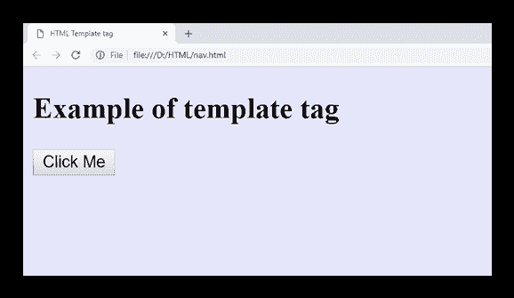

# HTML<template></template>

> 原文：<https://www.javatpoint.com/html-template-tag>

HTML<template></template>

模板的内容将不会显示，直到它没有被激活使用 JavaScript。浏览器在加载页面时处理<template></template>

当您希望在 HTML 文档中多次使用相同的内容而不做任何更改时，这也很有用。

<template></template>

<template></template>

### 句法

```

    <template>.........</template>

```

**以下是关于 HTML <模板>标签**的一些规范

| **显示** | **无** |
| **开始标签/结束标签** | 开始和结束标记 |
| 用法 | 格式化 |

### 例子

```

<!DOCTYPE html>
<html>
<head>
<title>HTML Template tag</title>
<style>
body{
  background-color: #e6e6fa;
}
</style>
</head>
<body>
  <h2>Example of template tag</h2>
  <button onclick="clickMe()">Click Me</button><br>

 <template id="mytemplate">
   
   <script>
   alert("Thank you for choosing template. Click OK for image.")
   </script>
  </template>

<script>
   function clickMe() {
    var x= document.getElementsByTagName("template")[0];
    var clon = x.content.cloneNode(true);
    document.body.appendChild(clon);}
</script>
</body>
</html>

```

[Test it Now](https://www.javatpoint.com/oprweb/test.jsp?filename=htmltemplatetag)

**输出:**



## 属性:

### 特定于标签的属性:

<template></template>

### 全局属性:

<template></template>

## 支持浏览器

| **元素** | 铬 |  IE |  Firefox | 歌剧 |  Safari |
| **<模板>** | 是 | 不 | 是 | 是 | 是 |