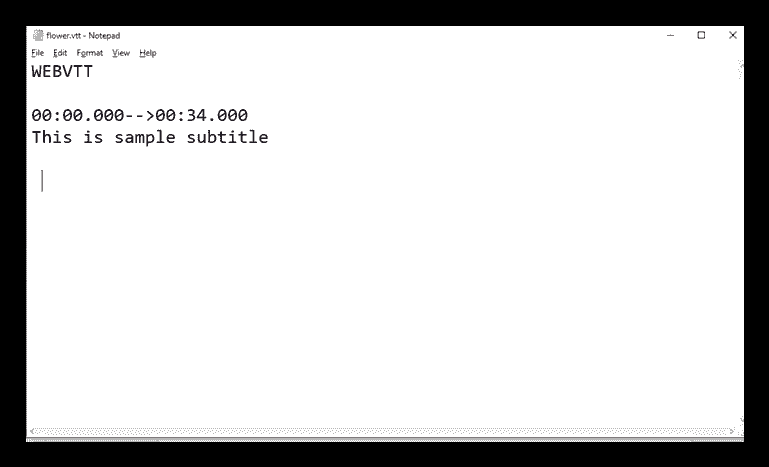

# HTML <track>标签

> 原文：<https://www.javatpoint.com/html-track-tag>

HTML <track>标签用于为媒体文件定义基于时间的文本轨道。<track>标签必须用作

<audio>和<video>元素的子元素。</video></audio>

<track>标签用于添加字幕、说明或媒体文件播放时显示的任何其他形式的文本。

HTML <track>是 HTML5 中的新标签。

### 句法

```

    <track src=" " kind=" " srclang=" " label=" ">

```

**以下是关于 HTML <轨道>标签**的一些规范

| **显示** | **无** |
| **开始标签/结束标签** | 仅开始标记(禁止结束标记) |
| 用法 | HTML 媒体 |

### 例子

```

 <!DOCTYPE html>
<html>
<head>
<title>HTML track Tag</title>
</head>
<body>
 <h2>Example of track tag</h2>
 <video controls="controls">
     <source src="flower.mp4" type="video/mp4">
    <track src="flower.vtt" kind="subtitles" srclang="en" label="English">
    Sorry!Your browser does not support the track
 </video>
</body>
</html>

```

[Test it Now](https://www.javatpoint.com/oprweb/test.jsp?filename=htmltracktag)

在上面的例子中，我们已经使用 flower.vtt 文件在视频文件中添加了字幕。以下是 flower.vtt 文件:



## 如何创建 WEBVTT 文件:

以下是为<track>标签创建 WEBVTT 文件的一些基本步骤:

1.  在电脑中打开文本编辑器，如记事本
2.  将 WEBVTT 作为编辑器中的第一行
3.  留一个空行
4.  以适当的格式指定持续时间(您也可以提供编号和添加 CSS)。
5.  输入并写出您想要添加字幕或说明的文本，重复步骤 3 至 5，直到完成。
6.  使用保存。vtt 分机。

现在您的 WEBVTT 文件可以使用了。

## 属性:

### 特定于标签的属性:

| 属性 | 价值 | 描述 |
| 系统默认值 | 系统默认值 | 它指定轨道应被启用，除非用户？的偏好表明另一个轨道更重要。 |
| 种类 | 字幕
章节
描述
元数据
字幕 | 它指定您想要添加哪种类型的文本轨道。 |
| 标签 | 文本 | 它指定文本轨道的标题。 |
| 科学研究委员会 | 统一资源定位器 | 它定义了轨道文件的网址。 |
| src lang！src lang！src lang！src lang！src lang | 语言代码 | 它定义了曲目文本内容的语言，如英语、德语等。 |

### 全局属性:

<track>标签支持 HTML 中的全局属性。

### 事件属性:

<track>标签支持 HTML 中的事件属性。

## 支持浏览器

| **元素** | 铬 |  IE |  Firefox | 歌剧 |  Safari |
| **<赛道>** | 是 | 是 | 是 | 是 | 是 |