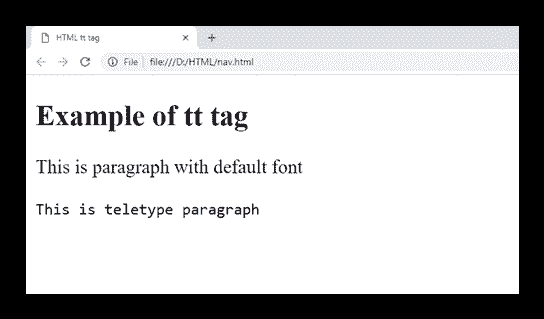

# HTML `tag (Not supported in HTML5)`

> 原文：<https://www.javatpoint.com/html-tt-tag>

HTML `标签用于定义等宽字体或固定宽度字体的文本，以便在浏览器上呈现为电传打字机、纯文本屏幕或行式打印机。`

**注意:不要使用 HTML < tt >标签，因为 HTML5 不支持，为了更好的使用，可以改为使用以下标签:**

*   `:表示计算机编程代码`
*   ```html
    :在纯文本中保留换行符和缩进。
    ```

*   `:表示键盘输入。`
*   `:表示方程中的变量`
*   <samp>:将文本表示为样本输出。</samp>

### 句法

**以下是关于 HTML < tt >标签**的一些规范

| **显示** | **直列** |
| **开始标签/结束标签** | 开始和结束标记 |
| 用法 | 格式化 |

### 例子

```html

<!DOCTYPE html>
<html>
<head>
<title>HTML tt tag</title>
</head>
<body>
<h2>Example of tt tag</h2>
<p>This is paragraph with default font</p>
<p><tt>This is teletype paragraph</tt></p>
</body>
</html>

```

[Test it Now](https://www.javatpoint.com/oprweb/test.jsp?filename=htmltttag)

**输出:**



## 属性:

### 特定于标签的属性:

`标签不包含任何特定属性。`

## 支持浏览器

| **元素** | 铬 |  IE |  Firefox | 歌剧 |  Safari |
| **<【TT】>** | 是 | 是 | 是 | 是 | 是 |