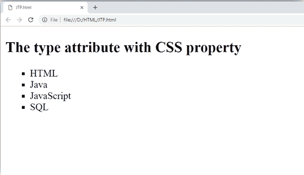

# HTML 无序列表| HTML 项目符号列表

> 原文：<https://www.javatpoint.com/html-unordered-list>

**HTML 无序列表**或项目符号列表以项目符号格式显示元素。我们可以使用无序列表，不需要以任何特定的顺序显示项目。HTML ul 标签用于无序列表。项目符号列表可以有 4 种类型:

*   唱片
*   圆
*   平方
*   没有人

为了表示不同的有序列表，

| 类型 | 描述 |
| 键入“光盘” | 这是默认样式。在这种样式中，列表项用项目符号标记。 |
| 键入“圆形” | 在这种样式中，列表项用圆圈标记。 |
| 键入“方形” | 在这种样式中，列表项用正方形标记。 |
| 键入“无” | 在这种样式中，列表项不会被标记。 |

* * *

## HTML 无序列表示例

```
<ul>
 <li>HTML</li>
 <li>Java</li>
 <li>JavaScript</li>
 <li>SQL</li>
</ul>

```

[Test it Now](https://www.javatpoint.com/oprweb/test.jsp?filename=htmlunorderedlist1)

输出:

*   HTML
*   爪哇
*   Java Script 语言
*   结构化查询语言

* * *

## ul type= "圆形"

```
<ul type="circle">
 <li>HTML</li>
 <li>Java</li>
 <li>JavaScript</li>
 <li>SQL</li>
</ul>

```

[Test it Now](https://www.javatpoint.com/oprweb/test.jsp?filename=htmlunorderedlist2)

输出:

*   HTML
*   爪哇
*   Java Script 语言
*   结构化查询语言

* * *

## ul type="square "

```
<ul type="square">
 <li>HTML</li>
 <li>Java</li>
 <li>JavaScript</li>
 <li>SQL</li>
</ul>

```

[Test it Now](https://www.javatpoint.com/oprweb/test.jsp?filename=htmlunorderedlist3)

输出:

*   HTML
*   爪哇
*   Java Script 语言
*   结构化查询语言

* * *

## ul type= "无"

```
<ul type="none">
 <li>HTML</li>
 <li>Java</li>
 <li>JavaScript</li>
 <li>SQL</li>
</ul>

```

[Test it Now](https://www.javatpoint.com/oprweb/test.jsp?filename=htmlunorderedlist4)

输出:

*   HTML
*   爪哇
*   Java Script 语言
*   结构化查询语言

#### 注意:HTML5 不支持类型属性，可以使用列表样式类型的 CSS 属性来代替类型。下面是显示 ul 标签的 CSS 属性的示例。

```
<ul style="list-style-type: square;">
	<li>HTML</li>
	<li>Java</li>
	<li>JavaScript</li>
	<li>SQL</li>
  </ul>

```

**代码:**

```
<!DOCTYPE html>
<html>
 <head>
  </head>
 <body>
 <h2>The type attribute with CSS property</h2>
   <ul style="list-style-type: square;">
	<li>HTML</li>
	 <li>Java</li>
           <li>JavaScript</li>
           <li>SQL</li>
    </ul>
 </body>
</html>	

```

[Test it Now](https://www.javatpoint.com/oprweb/test.jsp?filename=htmlunorderedlist5)

**输出:**



* * *

## 支持浏览器

| 元素 | 铬 |  IE |  Firefox | 歌剧 |  Safari |
|  | 是 | 是 | 是 | 是 | 是 |